# KARTA_SPACE MVP Implementation Specification — v0.2 "またね"

**Version:** MVP v0.2 (revision 4)
**Status:** Ready for implementation planning
**Builds on:** `KARTA_SPACE_MVP_Implementation_Spec.md` v0.1 and the current `karta_space_demo` codebase
**Primary goal:** Turn a well-made farewell card into a *moving* one, one that connects the present to the next time the two people meet.

> Everything in v0.1 still applies unless this document overrides it. Where it overrides v0.1, it says so.
>
> **Part A** is the specification. **Part B** holds the diagrams: use cases, sequences, data flow, and state. **Part C** indexes the per-feature design mockups.

### Revision history

| # | Change | Sections |
|---|---|---|
| R1 | **No calendar integration in the MVP.** The `.ics` download and its route are removed and deferred. | §4, §8.4, §20 |
| R2 | **Everything the receiver writes goes to the sender.** Replies and comets are delivered to the sender's inbox; nothing is stored by KARTA_SPACE. | §2, §10, §11 |
| R3 | **The receiver never authenticates.** No accounts or logins; a name is the only thing they give. The optional card password is a shared key on the card, not a user identity. | §2, §10, §11 |
| R4 | **Sealed messages go both ways.** The sender can send one in config; the receiver can send one back. | §5, §11 |
| R5 | **The sender, not the receiver, is reminded** on the satellite's date. | §12.1 |
| R6 | Use case, sequence, data flow and state diagrams; per-feature mockups. | Part B, Part C |
| R7 | **Contrail colours drift.** The trail is a gradient of colours that changes slowly and randomly, seeded per card. | §9.1 |
| R8 | **The time capsule becomes a comet (彗星).** A sealed message rides a long orbit and comes back on the reunion date. Its position in the sky *is* the countdown. | §3, §5, §6, §11, §14, §21 |
| R9 | **Editor v2.** Every new field, a live preview with state and date jumps, a setup checklist, and a signature pad. | §15 |
| R10 | **Issue a share link with a password from the editor.** The password is stored as a salted hash in config (env passwords still work and take precedence), with an optional hint on the gate. | §14.9, §15.6 |
| R11 | **One inbox for the sender.** A global `NOTIFY_TO`, with an optional per-card override. | §14.7 |
| **R12** | **8-point grid.** Every margin, padding, gap and offset is a multiple of 8; controls are 48px (40px in the editor); line heights sit on a 4px baseline. Checked by `verify`. | §23.1 |
| **R13** | **A living space with dynamic light.** Layered nebula with dust lanes and filaments, twinkling and bright stars, dust motes, grain and vignette, camera breathing at rest, and one moving key light that drives the planet terminator, atmosphere and the satellite's glints. A properly lit planet. | §23.2–23.6 |

---

# Part A — Specification

## 0. Read this first (for the implementer)

1. **This repo runs a version of Next.js newer than most training data.** Per `AGENTS.md`, read the relevant guide in `node_modules/next/dist/docs/` before writing routes, dynamic rendering, caching, or `notFound` handling. §14 depends on this.
2. The codebase has strong conventions. Keep them:
   - The experience is a **pure reducer** (`lib/experienceState.ts`) with no timers and no side effects.
   - **The thing that is animating ends its own phase** by dispatching an event.
   - **One deliberate gesture moves one step** (`lib/useFaceNavigation.ts`).
   - `CameraRig` is the **only** owner of the camera.
   - Every optional feature **disappears completely when its config is absent**, as `secret` does today.
   - Validation rules live once, in `lib/cardRules.ts`, and are enforced by build, editor and `npm run verify`.
   - `npm run verify` is the gate. Every new state, predicate, framing rule, content rule and pure helper gets checks there.
3. **A card with none of the new fields must behave exactly as it does today.** Treat this as an acceptance criterion (§18). The one exception is the visual system (§23): the living space, dynamic light and 8-point spacing apply to every card.
4. **Working with Claude Code.**
   - Commit this file to the repo as `docs/spec-v0.2.md`, and link it from `docs/README.md`.
   - Implement **one phase of §19 per session**. Start each one with: "Read `docs/spec-v0.2.md` §0, §19 phase N and every section that phase cites. Implement it. Add the verify checks it lists (§17). Finish with `npm run verify` and `npm run typecheck` green, and update the docs named in §16."
   - For anything visual, open the matching frame in the mockup canvas (Part C) for composition and motion, and use §23.6 to map each mock animation to its implementation. The numbers in this spec win over the frames.
   - When a phase needs a decision the spec leaves open, record it in `docs/` in the same commit rather than guessing silently.

---

## 1. Why v0.2

v0.1 asked whether a six-sided 3D card is more engaging than a message page. The cube answers that for about the first minute. A review of the product found three gaps:

| Gap | What the receiver feels today |
|---|---|
| **Repetition.** The same "spin → read a paragraph" loop six times. | The spectacle wears off by face 4 and it becomes a reading task. |
| **Generic.** Nebula, stars and cube are identical for every receiver. | Beautiful, but not *about them*. Only the text is personal. |
| **Dead end.** After face 6 the camera pulls back and the scene dims under a 95% black overlay. | "This is over." A farewell that feels like a memorial. The only future-facing element is Instagram/GitHub/LinkedIn icons. |

The sample content already reaches for a reunion: 「またどこかで会いましょう」, 「またいつか、どこかで。」. The product has nowhere to take that feeling.

### v0.2 hypothesis

> A farewell card feels more moving when (a) the letter *transforms* instead of ending, (b) the space around it holds things only the two people share, and (c) it leaves something that comes back.

### Core concept

**Farewells rarely mean never meeting again. KARTA_SPACE connects the present to the future: さようなら becomes またね.**

---

## 2. Design principles

### Carried over from v0.1 (non-negotiable)

- Space-like, immersive, **elegant rather than game-like, cinematic but restrained**.
- Content order is fixed; only motion is varied.
- Text is readable, upright, and real DOM.
- UI never competes with the scene.
- Build the experience first, the platform later.
- Procedural visuals where possible (no heavy asset downloads).

### New in v0.2

1. **One object, one journey.** The new features are stages in the life of **the same cube**: it arrives along a trail, is read, deploys into orbit as a satellite, receives a reply, and comes back.
2. **Transformation over ending.** The letter does not stop. It turns into the thing that returns.
3. **Every feature is a real space object that behaves like one.** The trail is the path the cube travelled. The satellite orbits and comes round. A sealed message is a comet: it goes far away and returns on schedule. When the metaphor and the mechanics agree, nothing needs explaining.
4. **Objects, not buttons.** The receiver interacts with things in the scene (the satellite, the trail, the planet, the comets). DOM buttons exist only as quiet accessible equivalents.
5. **Offers wait.** Nothing new appears while the receiver is still taking in the ending. Every offer is delayed and staggered, following the existing `SECRET_HINT_MS` philosophy: "an offer that appears immediately is just another button."
6. **Loud is wrong.** No explosions, confetti, or "blast off". Launches are soft lights rising; arrivals are glows, not flashes.
7. **Seal on the server.** Anything promised as "unreadable until a date" must never be readable before that date, whether it reaches the receiver's browser or the sender's inbox.
8. **The receiver never signs in.** A name typed into a form is the only identity they give.
9. **Everything the receiver writes goes to the sender.** KARTA_SPACE is a courier, not a store. There is no database in v0.2; the sender's inbox is where replies and comets live.
10. **The sender is the one reminded.** The product nudges the sender on the day, and the sender reaches out as a person. The software never messages the receiver directly.
11. **Warm light means "from the receiver" or "opened".** Everything else stays ion-blue. This single colour rule lets the receiver tell their own things apart at a glance.
12. **Alive, not busy.** Everything in the space moves a little and is lit by one slowly moving sun, but nothing is ever noticed moving on its own, and nothing moves behind text while it is being read (§23).
13. **One grid.** Layout lives on 8 points; nothing is placed by eye (§23.1).

---

## 3. The journey (narrative)

```text
 ACT 1  ARRIVAL      (Password gate with the sender's hint, if the card has one.)
   │                 Landing. Behind the title, a faint trail of light recedes into the
   │                 distance: the path the cube travelled to get here. Its colours drift.
   │                 "2026年3月に書かれた手紙" — the letter knows when it was written.
   │
 ACT 2  THE LETTER   The six faces, as today. One face may be a single large line.
   │                 Soft procedural sound: a tone as each face lands.
   │
   │                 Closing screen: the closing line is drawn, followed by the sender's
   │                 own handwritten signature, stroke by stroke.
   │                 (Inside-the-cube secret unchanged.)
   │
 ACT 3  DEPLOYMENT   "この手紙には、続きがあります。" → scroll on / 「軌道へ送り出す」
   │                 The overlay lifts. The cube turns, unfolds four solar panels
   │                 (a CubeSat), pulses once, and rises into a slow orbit around a
   │                 small pale planet: 「あなたの星」.
   │
 ACT 4  THE SPACE    The orbit view. Everything is visible at once:
   │     (hub)       · the satellite — tap: 「次のクリスマスに、また。」 + countdown
   │                 · the trail     — tap / scroll on: look back through the memories
   │                 · the planet    — tap: write a reply, launched as a rocket (to the sender)
   │                 · a comet       — far out on its long orbit: the sender's sealed
   │                                   message, on its way back for the reunion day
   │                 · the receiver can release a comet of their own (to the sender)
   │
 ACT 5  LOOKING BACK The camera flies back along the trail. Memories hang on it, newest
   (contrails)       first: photo, title, date (possibly just "2023年夏頃"), caption.
                     One gesture = one memory. The end of the trail returns to orbit.

 LATER  THE DAY      Over the last weeks the comets visibly swing back, tails growing.
                     On the satellite's date the sender gets an email, and reaches out.
                     When the receiver reopens the link, the satellite has come round,
                     glowing, and the sender's comet is here: its message can be read.
                     The receiver's comet reaches the sender the same day.
```

### Who gets what

| | Receives | How |
|---|---|---|
| **Receiver** | the card, the orbit, memories, the satellite message, the sender's comet (readable on the day) | by opening the card link (no account) |
| **Sender** | replies (rockets), the receiver's comets (as links that open on the day), the satellite-day reminder | by email to `NOTIFY_TO` |

### Naming (internal ↔ user-facing)

| Internal | Japanese in UI | Meaning |
|---|---|---|
| `cube` | (none) | the letter, six faces |
| `satellite` | 衛星 | the deployed cube; carries the "see you next time" message; comes round on the day |
| `memories` / trail | 航跡 | the contrail: memory timeline |
| `reply` / rocket | 返事 | the receiver's reply, launched from the planet, delivered now |
| `comet` | 彗星 | a sealed message on a long orbit that returns on a date, in either direction |
| planet | あなたの星 | the receiver's side; origin of the rocket and the receiver's comet |

---

## 4. Scope

### Included in v0.2

| # | Feature | Priority | Server work |
|---|---|---|---|
| F1 | Orbit hub (`orbit` state) + CubeSat deployment animation | **Must** | none |
| F2 | Satellite: message, date, countdown, "returned" state after the date | **Must** | computed in page |
| F3 | Contrail memory timeline, with drifting random colour gradient | **Must** | media route (F9) |
| F4a | The sender's comet (config), unreadable until it returns | **Must** | computed in page |
| F4b | The receiver's comet, delivered to the sender as a link that opens on the day | **Must** | comet route + comet page + email |
| F5 | Procedural sound (Web Audio), opt-out toggle | **Must** | none |
| F6 | Handwritten signature drawn on the closing screen | Should | none |
| F7 | `line` face style: one short sentence in large type | Should | none |
| F8 | "Written in…" line on landing (`writtenAt`) | Should | none |
| F9 | Access-checked media route for memory photos (not `/public`) | **Must** if F3 ships with real photos | media route |
| F10 | Rocket reply, delivered to the sender by email, nothing stored | **Must** | reply route + email |
| F11 | Satellite-day reminder email **to the sender** (daily scheduled job, stateless) | Should | cron route + email |
| F12 | Editor v2 for all new fields, with live preview | **Must** | dev only |
| F13 | Real star sky for a given place/date | Stretch (may slip to v0.3) | none |
| F14 | Share link + password issued from the editor; hint on the gate | **Must** | access changes |

### Excluded from v0.2

Calendar integration (`.ics`, Google Calendar links), any message sent directly to the receiver, database, accounts or any receiver authentication, dashboard, multi-author collaboration, stored replies, analytics, access logs, QR codes, AI objects, video, one-click deploy from the editor.

---

## 5. Content model

All additions are optional. `types/card.ts`:

```ts
export type TextFace = {
  type: "text";
  body: string;
  /**
   * "paragraph" (default): 80–250 chars, as today.
   * "line": one short sentence (1–30 chars) set large and centred — a beat, not a paragraph.
   */
  style?: "paragraph" | "line";
};

/** "2023" | "2023-08" | "2023-08-14". Month or day may be unknown. */
export type FuzzyDate = string;

export type MemoryImage = {
  /** A file in private/cards/<slug>/, served through the media route (§14.3). */
  src: string;
  alt: string;
  fit?: "cover" | "contain";
};

export type Memory = {
  title: string;              // ≤ 24 chars, e.g. "はじめての打ち上げ"
  date: FuzzyDate;
  /** Shows 頃 after the date: "2023年8月頃". */
  approx?: boolean;
  /** Optional season when month is unknown: "2023年夏". Ignored if month is set. */
  season?: "spring" | "summer" | "autumn" | "winter";
  image?: MemoryImage;
  caption?: string;           // ≤ 80 chars, shown under the image
};

export type Satellite = {
  label: string;              // ≤ 16 chars, e.g. "次のクリスマス"
  message: string;            // ≤ 60 chars, e.g. "次のクリスマスに、また会おう。"
  date: string;               // "YYYY-MM-DD", in the card's timeZone
  repeat?: "none" | "yearly"; // default "none"
};

export type Comet = {
  /** "YYYY-MM-DD" the comets come back. Defaults to the satellite's next date. Required without a satellite. */
  returnsOn?: string;
  /** After the first return, come back every year on the same day. Default: satellite.repeat === "yearly". */
  yearly?: boolean;
  /** The sender's comet (F4a): its message, ≤ 250 chars. Omit for no sender's comet. */
  message?: string;
  /** "YYYY-MM-DD" the sender's comet set off. Default: the first day of writtenAt's month, else the build date. */
  releasedOn?: string;
  /** Let the receiver release a comet back to the sender (F4b). Default false. */
  receiverCanRelease?: boolean;
};

export type ReplyConfig = {
  /** Optional prompt above the reply field. Default: "ひとこと、返事をどうぞ。" */
  prompt?: string;
};

export type CardAccess = {
  /**
   * Written by the editor (§15.6). "scrypt$<N>$<r>$<p>$<salt b64>$<hash b64>".
   * The password itself is never stored in this file.
   */
  passwordHash?: string;
  /** Optional hint shown on the password gate, ≤ 40 chars, e.g. "はじめて会った駅の名前（ひらがな）". */
  hint?: string;
};

export type CardConfig = {
  // … all v0.1 fields unchanged (slug, title, subtitle, faces, closing, secret, social)
  /** How the sender signs off to the receiver, e.g. "みお". Default "送り主". */
  from?: string;
  writtenAt?: FuzzyDate;      // landing: "2026年3月に書かれた手紙"
  timeZone?: string;          // IANA, default "Asia/Tokyo"; used for every date comparison
  signature?: string;         // path to an SVG of the sender's handwriting (§13.1)
  sound?: boolean;            // default true; false removes sound entirely for this card
  memories?: Memory[];        // 1–12
  satellite?: Satellite;
  comet?: Comet;
  reply?: ReplyConfig;        // presence enables the rocket, only if email is configured (§14.7)
  access?: CardAccess;        // share password (§14.9)
};
```

The sender's email address and every secret live in the environment, never in config. `access.passwordHash` is a salted, slow hash, not a secret by itself, but still never sent to a browser (§14.1).

### Presence rules

- **Orbit exists** (`hasOrbit`) if the card has at least one of: `satellite`, `memories` (≥ 1), `comet`, or an available `reply`. Without any of them, `completed` behaves exactly as today: forward scroll does nothing, and there is no deployment offer.
- Each hub object renders only if its config exists: no memories → no trail (on landing or in orbit); no satellite → the deployed cube still orbits but is not tappable for a message; no available reply → the planet is not interactive.
- **Comet availability:**
  - `senderComet` exists if `comet.message` is non-empty.
  - `receiverComet` is available if `comet.receiverCanRelease` is true **and** email + `COMET_SECRET` are configured **and** the effective `returnsOn` is in the future (for `yearly`, the next occurrence is used).
  - The comet hub entry exists if either is present.

### Fuzzy date display (`lib/fuzzyDate.ts`, pure)

| Input | approx | season | Output |
|---|---|---|---|
| `"2023-08-14"` | – | – | `2023年8月14日` |
| `"2023-08"` | – | – | `2023年8月` |
| `"2023-08"` | true | – | `2023年8月頃` |
| `"2023"` | – | `"summer"` | `2023年夏` |
| `"2023"` | true | – | `2023年頃` |

Sort key: `(year, month ?? season-midpoint ?? 6.5, day ?? 15)`. Ties keep config order. **Memories are always shown newest → oldest; config order is not display order.**

### Validation additions (`lib/cardRules.ts`)

| Rule | Severity |
|---|---|
| `memories.length > 12` | error |
| memory `date` not matching `^\d{4}(-\d{2}(-\d{2})?)?$`, or invalid month/day | error |
| memory image `src` empty / folder | error |
| memory image outside `private/cards/<slug>/` | warning |
| memory title empty / > 24, caption > 80, missing image alt | warning |
| `satellite.date`, `comet.returnsOn`, `comet.releasedOn` not a valid `YYYY-MM-DD` | error |
| `comet` present with neither `returnsOn` nor `satellite` | error |
| `comet` present with neither `message` nor `receiverCanRelease` | error |
| `comet.releasedOn` on or after `returnsOn` | error |
| `satellite.message` > 60, `label` > 16 | warning |
| `comet.message` > 250 | warning |
| `line` face outside 1–30 chars | warning (replaces the 80–250 check for that face) |
| `closing` > 18 chars | warning: "draws at about 14px on a phone" |
| `from` > 16 chars | warning |
| `timeZone` not accepted by `Intl.DateTimeFormat` | error |
| `access.passwordHash` not in the `scrypt$…` format | error |
| `access.hint` > 40 chars | warning |
| slug's random part shorter than 8 characters | warning: "guessable link" |
| `reply` or `receiverCanRelease` set but mail env incomplete / `COMET_SECRET` unset | NOTE in verify only; the feature simply isn't offered |
| `access.passwordHash` set but `ACCESS_SECRET` unset | NOTE in dev; **error** in a production build |
| `signature` file missing | error in verify |

---

## 6. Experience flow (state machine)

Extend `lib/experienceState.ts`. It stays pure: no timers, no async. The full diagram is in **Part B §B4**.

### 6.1 Experience shape

```ts
export type Experience = {
  state: ExperienceState;
  activeFace: number;      // 0..5, as today
  activeMemory: number;    // 0 = newest
  panel: OrbitPanel;       // which orbit panel is open, if any
  launched: boolean;       // a reply was launched this session
  released: boolean;       // the receiver released a comet this session
  // Fixed per card, set by initialExperience(ctx):
  memoryCount: number;
  hasOrbit: boolean;
};

export type OrbitPanel = null | "satellite" | "reply" | "comet";

export function initialExperience(ctx: { memoryCount: number; hasOrbit: boolean }): Experience;
```

### 6.2 New states

| State | Meaning | Ended by |
|---|---|---|
| `deploying` | cube turns, unfolds panels, rises into orbit; camera pulls out to orbit pose; overlay lifts | `MessageCube` → `deployEnd` |
| `orbit` | the hub, at rest | – |
| `undeploying` | reverse: panels fold, cube returns, camera to far pose, scene dims | `MessageCube` → `deployEnd` |
| `rewinding` | camera leaves the orbit pose and joins the trail at the newest memory | `CameraRig` → `zoomEnd` |
| `remembering` | a memory is framed and its text is shown | – |
| `drifting` | camera travels along the trail to the adjacent memory | `CameraRig` → `zoomEnd` |
| `resurfacing` | camera leaves the trail back to the orbit pose | `CameraRig` → `zoomEnd` |
| `launching` | the rocket rises from the planet and becomes a star | `RocketLaunch` → `launchEnd` |
| `releasing` | the receiver's comet swings round the planet and heads out on its orbit | `CometRelease` → `releaseEnd` |

### 6.3 New events

```ts
| { type: "deploy" }            // button equivalent of move(+1) at completed
| { type: "dock" }              // button equivalent of move(-1) at orbit
| { type: "deployEnd" }
| { type: "lookBack" }          // enter the trail from orbit; from the trail, leave it
| { type: "openPanel"; panel: Exclude<OrbitPanel, null> }
| { type: "closePanel" }
| { type: "launch" }            // dispatched ONLY after the server accepted the reply (§10)
| { type: "launchEnd" }
| { type: "release" }           // dispatched ONLY after the server accepted the comet (§11)
| { type: "releaseEnd" }
```

### 6.4 Transitions

```text
completed ──move(+1) / deploy [hasOrbit]──> deploying ──deployEnd──> orbit
orbit ──move(-1) / dock [panel=null]──> undeploying ──deployEnd──> completed

orbit ──move(+1) / lookBack [memoryCount>0, panel=null]──> rewinding ──zoomEnd──> remembering(activeMemory=0)
remembering ──move(+1) [not last]──> drifting(activeMemory+1) ──zoomEnd──> remembering
remembering ──move(-1) [not first]──> drifting(activeMemory-1) ──zoomEnd──> remembering
remembering ──move(-1) at first / move(+1) at last / lookBack──> resurfacing ──zoomEnd──> orbit

orbit ──openPanel(p)──> orbit (panel=p)
orbit ──closePanel──> orbit (panel=null)
orbit(panel="reply") ──launch──> launching ──launchEnd──> orbit (panel=null, launched=true)
orbit(panel="comet") ──release─> releasing ──releaseEnd─> orbit (panel=null, released=true)
```

Every existing transition is unchanged. In particular `completed ──move(-1)──> returning`, `replay`, and the `reveal` / inside branch stay as they are.

Notes:

- **At the end of the trail, going forward returns to orbit.** The trail ends where it began, so the reader is never stuck.
- **While a panel is open, `move` events are ignored** (the reader may be typing). Close it with `closePanel` (✕ button, Escape, or tapping empty space).
- `useFaceNavigation` **must ignore key and wheel events whose target is an `input`, `textarea`, or `[contenteditable]`.** Otherwise Space and arrow keys inside a text field would navigate. This is a required change to the hook.

### 6.5 Derived predicates

```ts
export type CameraPhase = "far" | "near" | "inside" | "orbit" | "trail";

cameraPhase(state):
  descending, inside                                   → "inside"   (unchanged)
  entering, returning, reading, transitioning          → "near"     (unchanged)
  deploying, orbit, launching, releasing, resurfacing  → "orbit"
  rewinding, remembering, drifting                     → "trail"
  everything else (incl. undeploying)                  → "far"

revealsText(state)    // reading only — UNCHANGED
revealsSecret(state)  // inside only — UNCHANGED
revealsMemory(state)  // remembering only — memory title/date/caption attached only then
isDeployed(state)     // deploying | orbit | undeploying | rewinding | remembering |
                      // drifting | resurfacing | launching | releasing — cube renders in its
                      // satellite form (panels open, reduced scale, on its orbit)
dimsScene(state)      // UNCHANGED set; orbit/trail states are NOT dimmed
acceptsInput(state)   // reading | completed | inside | orbit | remembering
```

The rule that face text appears **only** in `reading` still holds everywhere. Memory text follows the same rule for `remembering`.

### 6.6 Dev-only state jump (`?at=`)

For the editor's preview (§15.3), in development only, `/c/[slug]?at=<target>` starts the experience at a given point. The reducer is not changed: `lib/devJump.ts` computes the event sequence that reaches the target from `landing`, and `CardExperience` replays it with reduced-motion durations. Targets: `landing`, `face-1` … `face-6`, `closing`, `inside`, `orbit`, `trail`, `satellite`, `comet`, `reply`. Ignored in production (verify check). Combined with `?now=` (§14.1) it previews any state on any date.

---

## 7. Act 1: Arrival (password gate and landing)

**Password gate** (only if the card has a password, §14.9):

- Same layout as today (`PasswordGate.tsx`), plus the **hint** under the title when `access.hint` is set: `ヒント: はじめて会った駅の名前（ひらがな）`, colour `--lunar`, 13px.
- The input is forgiving: what the receiver types is normalised before checking (NFKC, spaces and hyphens removed, Latin lowercased, katakana → hiragana), so `カマクラ`, `かまくら` and `ｶﾏｸﾗ` all match, and `k7qm 2xpa` matches `K7QM-2XPA`.
- Wrong password: `パスワードが正しくありません。` (unchanged). Rate limit unchanged.

**Landing:**

- If `memories` exist, the landing scene shows the **trail** (§9.1) faintly behind the cube, receding into the distance at 25% of its orbit-view intensity, colours drifting. The overlay stays as it is; the trail should just be visible through it. This sets up Act 5.
- If `writtenAt` is set, show one quiet line under the subtitle: `2026年3月に書かれた手紙` (colour `--lunar`, 0.8em, letter-spacing 0.08em).
- **After the satellite's date has passed** (§8.4), replace that line with `衛星が、戻ってきました。`. With no satellite but a sender's comet that has returned: `彗星が、戻ってきました。`.
- Sound toggle (§12.2) sits top-right from the landing onwards.

---

## 8. Act 2 → 4: Closing, deployment, orbit, satellite

### 8.1 Closing screen changes (`CompletionState.tsx`)

1. The closing line is drawn with `StrokeText` as today. It is fitted to the width on one line, so on a phone a long line (the sample's 23 characters) draws at about 14px; the editor warns above 18 characters.
2. If `signature` is set: once the fill wipe finishes, draw the signature SVG underneath it, stroke by stroke (§13.1).
3. **Orbit offer** (only if `hasOrbit`): `ORBIT_HINT_MS = 3500` after the closing screen mounts, fade in:
   - line: `この手紙には、続きがあります。`
   - button (`button--quiet`): `軌道へ送り出す` → dispatches `deploy`
   - plus a small animated ↓ cue under it; scrolling forward does the same.
4. **Secret offer** keeps its behaviour, delayed to `SECRET_HINT_MS = 7000` when `hasOrbit` so the two offers don't arrive together. It is placed below the orbit offer and visually quieter.
5. **Social links move off the closing screen** into the orbit view when the card has an orbit: bottom-left on desktop, top-left on mobile (opposite the sound toggle, clear of the bottom bar), 44px targets. Without an orbit they stay on the closing screen as today. If all hrefs are empty or placeholders, render nothing. `npm run verify` keeps its placeholder NOTE.

### 8.2 Deployment animation (`deploying`, ~`DEPLOY_MS = 3200`)

Owned by `MessageCube` (new `CubeSat` layer inside it). `CameraRig` uses the same constant so both finish together; `MessageCube` dispatches `deployEnd`. The phase ends only when the cube says so.

| t | Cube | Camera / scene |
|---|---|---|
| 0–0.25 | slerp from face-6 orientation to the **display orientation** (a 3/4 view: yaw 35°, pitch −20°) | overlay starts fading; dimming lifts |
| 0.20–0.55 | four solar panels, folded flat against the four side faces, swing up 90° on hinges at the top edges until level with the top face (a cross), staggered 80 ms | camera begins pulling out and up to the orbit pose |
| 0.55–0.65 | one soft thruster pulse: additive glow under the cube, 0 → 1 → 0 | planet rises into the lower frame |
| 0.60–1.0 | cube scales 1 → `SAT_SCALE` (0.42) and eases onto its orbit path; faint orbit ring fades in (opacity 0 → 0.18) | camera settles at the orbit pose |

Panel look: thin (0.02-unit) plates as wide as the cube edge (2 units) and reaching 1.9 units, so a folded panel never hangs below the cube; `--navy` base with a fine ion-blue (`#00aeef`) cell-grid shader at low emissive intensity, `Edges` in `#9fb4c9` like the cube. They must read as elegant hardware, not a toy.

`undeploying` plays the same timeline in reverse and ends on the far pose with the scene dimmed, landing back in `completed` exactly as it was (same guarantee `ascending` gives today).

**Reduced motion:** 300 ms crossfade; the cube appears already deployed on its orbit.

### 8.3 The orbit view (`orbit`)

Composition (starting values; tune visually, but they must pass the framing checks in §17):

- **Planet 「あなたの星」:** radius 2.2, centred about (0, −3.4, −1). Only its upper arc is visible in the lower third of the frame. A properly lit sphere with clouds, a moving terminator, an atmosphere rim on the lit side and warm night-side lights; see §23.4 for the full shading spec.
- **Satellite (the cube):** follows a tilted ellipse around the planet centre (semi-axes 3.4 × 2.6, tilt 14°), period `ORBIT_PERIOD_S = 48`. It keeps its display orientation with a slow tumble (±6°).
- **Orbit ring:** 1px line, opacity 0.18.
- **Trail:** a static world-space curve whose near end sits just behind the orbit ring and which recedes and curves into −z (§9.1).
- **Comets:** at their real positions on their long orbits (§11.2). Usually far out and faint; near the day, close and bright with tails.
- **Launched-reply stars:** if `launched` (or stored locally, §10.4), a slightly brighter star with a faint cross-flare sits where the rocket ended.
- Scene not dimmed; nebula and wandering lights at normal intensity.

Interaction (r3f pointer events on meshes; hover gives a soft glow and `cursor: pointer`; every object has a hit area of at least 44px on screen):

| Object | Tap / click | Accessible DOM equivalent (bottom bar) |
|---|---|---|
| satellite | `openPanel("satellite")` | `衛星` |
| trail | `lookBack` | `航跡をたどる` |
| planet | `openPanel("reply")` | `返事を打ち上げる` |
| a comet | `openPanel("comet")` | `彗星` |
| (none) | – | `手紙に戻る` → `dock` |

The bottom bar uses the quiet button style and only lists what exists. Hint line on first arrival only: `星をタップしてみてください。`, fading after 4 s.

### 8.4 Satellite panel and "returned" state (no calendar)

Satellite **status** is computed on the server (§14.1) in the card's `timeZone`:

- `waiting`: now < satellite date.
- `returned`: now ≥ date (for `repeat: "yearly"`, on the date and for 14 days after each anniversary; otherwise `waiting` with the next occurrence).

Panel content (glass panel, centred, max-width 420px):

```text
衛星
────────────
次のクリスマスに、また会おう。          ← satellite.message (large)
2026年12月25日 · あと93日               ← formatted date + countdown (waiting)
その日が来たら、みおから連絡します。       ← fixed line with {from}; sets the expectation
```

There is **no calendar button**. The reminder goes to the sender (§12.1), and the last line tells the receiver that the sender will reach out.

When `returned`: the countdown line becomes `この日が、来ましたね。` and the last line is hidden. The satellite in the scene gains a steady warm glow and a slow halo pulse (period 4 s).

---

## 9. Act 5: Contrails (航跡)

### 9.1 The trail and its drifting colours

**Geometry.** A `CatmullRomCurve3` through 6–8 control points: starting just behind the orbit ring, curving gently (max lateral deviation ≈ 4 units) and receding to z ≈ −70 (inside the nebula sphere of radius 90). Deterministic per card: seed from the slug.

**Ribbon.** One ribbon mesh along the curve (camera-facing strip), additive, width tapering 0.10 → 0.02, with a vertex attribute `u` (0 at the near end → 1 at the far end). A few slow particles shed from it (≤ 120 points, reuse the `stars.ts` point style), tinted by the ribbon colour where they leave it.

**Colour: a random gradient that keeps changing (R7).**

- **Palette** — five colours, all drawn from the scene so the trail never looks foreign:

  | | Colour | Source |
  |---|---|---|
  | 0 | `#7fd4f5` | the closing line's stroke colour |
  | 1 | `#00aeef` | `--ion` |
  | 2 | `#8f7fd6` | `--nebula`, lifted for additive blending |
  | 3 | `#c77aa8` | the nebula shader's ember (`#6b3a63`), lifted |
  | 4 | `#e8e9eb` | `--starlight` |

- **Colour at a point** (`lib/trailColour.ts`, pure, mirrored in `shaders/ribbon.ts`):

  ```text
  drift(t) = 0.018·t + 0.35·sin(t/23 + s2) + 0.20·sin(t/37 + s3)       // t in seconds
  c(u, t)  = 5 · valueNoise1D(3.0·u + s1 + drift(t))                    // 0..5, smooth
  colour   = mix(palette[floor(c) mod 5], palette[(floor(c)+1) mod 5], smoothstep(fract(c)))
  alpha(u) = 0.95 · (1 − u)^1.3
  ```

  `s1, s2, s3` are seeded from the slug. The two sines have unrelated periods, like the nebula's flow field, so the drift never repeats.
- **What the receiver sees:** at any moment the trail shows two to four colours blending into each other along its length. The bands slowly slide and change; any one point takes 20–40 s to shift to a new colour. There are no jumps, flashes or cycling rainbows. Each card's trail has its own colours.
- **Near end:** for `u < 0.05` the colour blends toward starlight, so the trail reads as the cube's exhaust where it leaves the orbit.
- **Tinting what hangs on it:** memory glints take the trail colour at their `u`. The active memory panel's border and glow use that colour at 45%, so each memory carries its own slowly shifting tint.
- **Landing:** the same function at 25% intensity.
- **Reduced motion:** `drift(t)` is frozen at `t = 0`. The trail still has the card's random colours but they do not move.
- **Placement of memories:** evenly spaced curve parameters `u_i = 0.08 + i * step`, not time-proportional (even pacing reads better). Optionally nudge spacing by `log(1 + monthsBetween)`, clamped to ±30%.

### 9.2 Memory panel (`MemoryPanel.tsx`)

```text
┌──────────────────────────────┐
│                              │
│          [ image ]           │   square or 4:3; glass frame like a cube face
│                              │
├──────────────────────────────┤
│ はじめての打ち上げ              │   title — 1.25em, weight 500, --starlight
│ 2023年8月頃                   │   date — 0.8em, tabular, letter-spacing .1em, --lunar
│ 屋上でみた花火。来年も、と       │   caption — 0.9em, --cosmic-silver
│ 言ったのを覚えています。          │
└──────────────────────────────┘
```

- A memory without an image renders title/date/caption as a text-only panel at the same size.
- Text is DOM through `<Html transform>` using the same 40px-per-world-unit rule (`docs/framing-and-text.md`). Attach it **only** while `revealsMemory(state)`.
- The panel faces the camera's arrival direction along the trail and floats (±0.03 units, 6 s period). Its border takes the local trail colour (§9.1).
- Framing: the panel fills the same share of the viewport as a cube face (portrait 65–80% width, landscape 45–65% height). Add `memoryPanelFraming()` to `framing.ts` and cover it in verify.
- Distant memories on the trail show as small glints (a sprite), not full panels, to save draw calls. Only the active memory and its neighbours mount full panels.

### 9.3 Camera on the trail

- `CameraRig` is generalised from a scalar `z` to a **pose path**: `pose(u): { position: Vector3, lookAt: Vector3 }`. Existing phases keep their current behaviour as straight dolly paths along +z. Trail phases evaluate a segment of the trail curve, offset so the camera sits `MEMORY_VIEW_DISTANCE` in front of each memory, looking at it.
- `drifting` duration `DRIFT_MS = 1100` with `easeInOutQuint`, with a slight banking roll (≤ 4°) that returns to 0 on arrival. **It must land exactly square-on**, the same guarantee as face rotation.
- `rewinding` 1800 ms, `resurfacing` 1600 ms.
- UI while on the trail: a progress readout `3 / 8` styled like `CardProgress`, a hint on first memory `スクロールで、さらに昔へ`, and a quiet `軌道に戻る` button (dispatches `lookBack`).

### 9.4 Loading

Memory images must **not** block the landing button. v0.1's `useProgress` gating waits for everything, so:

- Load memory textures in a separate `<Suspense>` boundary that mounts once the reader reaches `reading`, then preload during reading.
- If the reader reaches the trail before an image is ready, show the panel with a soft shimmer in place of the image. Never block navigation.
- Size limits: ≤ 1600px on the long edge, WebP or JPEG, ≤ 350 KB each (verify warns above).

---

## 10. Rocket (reply → sender)

### 10.1 Availability

Offered only if `card.reply` exists **and** the mail env is complete (`RESEND_API_KEY`, `MAIL_FROM`, and a notify address, §14.7). The page receives only `replyAvailable: boolean`; the email address never reaches the browser.

### 10.2 Reply panel

```text
返事を打ち上げる
ひとこと、返事をどうぞ。            ← reply.prompt
[ お名前            ]            ← ≤ 20 chars, required. No login: this is the only identity.
[ メッセージ          ]           ← textarea, ≤ 140 chars, live counter "20 / 140"
すぐに、みおに届きます。            ← fixed line with {from}
[ 打ち上げる ]
```

- Submit → `POST /c/[slug]/reply` (§14.4). Button shows `送信中…` and is disabled.
- **Only when the server returns 200** does the client dispatch `launch`. The animation celebrates an actual delivery.
- On failure: `うまく届きませんでした。もう一度お試しください。` The panel stays open with its contents intact, and no launch happens.
- After `launchEnd`: the panel doesn't reopen. The planet's accessible button changes to `返事は届きました` (disabled for this session).
- The name field is remembered in `localStorage` (`ks_name`) so the comet form can prefill it. Wrap in try/catch.

### 10.3 Launch animation (`launching`, `LAUNCH_MS = 2600`)

1. A small point of light (rounded capsule sprite, ion-white) lifts off the planet's visible limb.
2. It rises on a gentle arc towards the orbit ring, leaving a thin fading exhaust ribbon (same ribbon shader as the trail, ion palette only, 1.2 s tail).
3. At the ring it slows, pauses beside the satellite's current position for 300 ms (a "meeting"), then drifts outward and settles as a new star with a faint cross-flare.
4. `RocketLaunch` dispatches `launchEnd`.

No shake, no flash, no particle burst. Reduced motion: the star fades in over 300 ms.

### 10.4 Persistence (viewer-only)

Store `{ at: ISODate }` for the launched star in `localStorage` under `ks_reply_<slug>`, wrapped in try/catch. Returning visitors see their star. Nothing else is stored anywhere except the email itself.

---

## 11. Comets (彗星): sealed messages that come back

### 11.1 Concept

A comet leaves, travels far out on a long orbit, and **returns on a date you can know in advance**. Halley's comet is the image. That is exactly what a time capsule between two people should do, so in v0.2 the time capsule *is* a comet (R8):

- A message is given to a comet. From then on it is **unreadable until the comet comes back**, on the reunion date.
- **The comet's position is the countdown.** Its orbit is real Kepler motion, so it spends most of the wait far out and faint, and in the last tenth of the wait it swings back quickly, tail growing. Nobody has to read a number to feel that the day is near.
- **Comets can come back again.** With `yearly`, after the first return the comet keeps a one-year orbit and returns on every anniversary: a periodic comet.
- **Both people can send one.**
  - **The sender's comet** (`送り主の彗星`, F4a) is set in config. It is ion-blue. When the receiver opens the card it is already somewhere on its way.
  - **The receiver's comet** (`あなたの彗星`, F4b) is released from the orbit view. It is warm-coloured (principle 11). It goes to the sender as a link that shows where the comet is, and opens on the day.

Why a comet rather than the alternatives:

| Candidate | Why not |
|---|---|
| A sealed capsule glyph (revision 2) | Static. It says "locked", not "coming back". It does not belong to the space. |
| A probe or a message into deep space (Voyager) | It never returns, which is the opposite of the concept. |
| A meteor shower | Returns yearly, but it is many streaks, not one message. It is kept as a flourish: a light shower of 3–5 streaks on the returned day. |
| Light from a star, arriving later | Poetic, but "the light arrives in 93 days" is hard to picture and has no visible progress. |

### 11.2 Orbit and appearance (`lib/cometOrbit.ts`, pure)

**Geometry** (world units; the satellite ring is 3.4 × 2.6):

- A long ellipse with the planet centre at one focus. Eccentricity `e = 0.86`, perihelion `q = 4.2` (just outside the satellite ring), so `a = q / (1 − e) = 30` and aphelion `Q ≈ 55.8`, inside the nebula sphere (radius 90).
- The orbit plane is tilted 22° from the satellite's, and the aphelion points into the far background (−z, slightly up). Each comet gets a small seeded rotation of its orbit (from slug + releasedOn) so two comets never overlap.

**Position from time:**

```text
f = clamp((now − releasedOn) / (returnsOn − releasedOn), 0, 1)   // 0 = released, 1 = back
M = 2π·f                                                         // mean anomaly
solve E − e·sin E = M  (Newton, 6 iterations)                    // eccentric anomaly
x = a(cos E − e),  y = a·√(1 − e²)·sin E                          // in the orbit plane
```

`f = 0` and `f = 1` are perihelion; `f = 0.5` is aphelion. For a 93-day wait the distance from the planet is:

| Days left | 93 | 84 | 47 | 23 | 9 | 5 | 1 | 0 |
|---|---|---|---|---|---|---|---|---|
| Distance (units) | 4.2 | 28 | 56 | 46 | 28 | 18 | 6 | 4.2 |

- **Just released:** a comet with `f < 0.06` is drawn at `f = 0.06`, already on its way out. Otherwise it would sit beside the planet for days after being sent.
- **Returned window:** from `returnsOn` for 14 days the comet holds at perihelion, slowly drifting, bright. Then:
  - with `yearly`, it sets off again, with `releasedOn` = the last return and `returnsOn` = the next anniversary;
  - otherwise it settles as a small steady star beside the planet, a keepsake.
  - *(Could)* The sender's comet then also joins the trail as the newest memory: title `{from}の彗星`, date `returnsOn`, caption its first sentence (≤ 80 chars).

**Appearance** (`components/three/Comet.tsx`):

- **Nucleus:** a small bright sprite; screen size at least 2.5px so a far comet can still be found. Far out (distance > 20) it pulses slowly (6 s) so the eye catches it.
- **Coma:** a soft glow around the nucleus, radius ∝ 1/distance, clamped.
- **Two tails**, both pointing away from the planet, the way real tails point away from the sun:
  - an **ion tail**: straight and narrow, `#7fd4f5` fading out;
  - a **dust tail**: wider, curving back along the orbit, `#e8e9eb` for the sender's comet or `#f3d7a4` (warm) for the receiver's.
  - Length `L = min(3.5, 60 / r²)` world units, where `r` is the distance from the planet, with opacity following it. There is no tail beyond r ≈ 25.
- **Orbit line:** a faint dotted ellipse, shown only while the comet's panel is open or on hover, so the sky stays clean.
- **Hit area:** at least 44px on screen, even when the nucleus is tiny.
- **Returned day:** a light meteor shower of 3–5 slow streaks crosses the sky once when the orbit view first opens on a returned day (and each yearly return).

**Mini orbit diagram** (`CometOrbitMini.tsx`, SVG, 132 × 64): this makes the metaphor readable in the UI.

- The dashed ellipse, a dot for the planet at the focus, and a small tick at perihelion labelled with the return date.
- The comet at its real position, with the label `いま、ここ`.
- The same diagram appears in the comet panel, in the release confirmation, and on the sender's comet page.

### 11.3 The comet panel (`CometPanel.tsx`)

It opens by tapping a comet, or `彗星` in the bottom bar. It has up to three sections.

**A. The sender's comet** (if `comet.message` is set):

```text
[mini orbit]  みおの彗星
              2026年12月25日に戻ってきます。
              あと93日
```

When it has returned:

```text
[mini orbit, comet at the tick]  みおの彗星が、戻ってきました。
                                 2026年3月に放たれました
<the message, face-text typography>
```

The message is not in the page payload before `returnsOn` (§14.1).

**B. Release your own** (if `receiverComet.available` and `released` is false):

```text
あなたも、彗星を放つ
2026年12月25日に戻ってくるまで、みおにも読めません。     ← makes the seal explicit
[ お名前            ]                                  ← prefilled from ks_name
[ メッセージ          ]                                 ← ≤ 200 chars, counter "0 / 200"
[ 彗星に託す ]
```

- Submit → `POST /c/[slug]/comet` (§14.5). The button shows `放っています…`.
- **Only on 200** does the client dispatch `release`. On failure: the same error copy as the reply; the contents are kept.

**C. After release** (replaces B):

```text
[mini orbit, warm comet just departed]
彗星を放ちました。2026年12月25日に、みおのもとへ戻ってきます。
[ 彗星の行方を見るリンクをコピー ]      ← Could: same link the sender got
```

### 11.4 Release animation (`releasing`, `RELEASE_MS = 3200`)

1. A warm point of light forms at the planet's limb, with a short warm dust tail.
2. It swings once around the planet (a slingshot), passing just beneath the satellite. That is the moment of hand-over, with a 250 ms soft brightening.
3. It heads out along its orbit, shrinking; the tail thins as the distance grows.
4. It settles as a faint warm glint at its displayed position (`f = 0.06`). `CometRelease` dispatches `releaseEnd`.

There is no exhaust ribbon: a comet is thrown, not powered. Reduced motion: the glint fades in at its position over 300 ms.

### 11.5 How the seal works (stateless)

- On submit the server builds `{ v: 1, slug, name, body, releasedOn, returnsOn }`. It encrypts this with **AES-256-GCM** using `COMET_SECRET` (32 random bytes, base64 in env), a random 12-byte IV and additional authenticated data `"karta-comet-v1"`.
- Token = base64url(`iv ‖ ciphertext ‖ tag`). With a body of ≤ 200 chars the token is about 1.1 KB, which is fine in a link.
- `releasedOn` and `returnsOn` are inside the ciphertext, so the dates can't be edited to open early, and the page can draw the comet's position without any storage.
- Any change to the token fails GCM authentication and shows the "not found" page.
- **Honest limit** (documented in `docs/access-and-security.md`): the seal is a promise kept by the software, not protection *from the operator*. Whoever holds `COMET_SECRET` can decrypt early, and in the MVP the sender is also the operator. Rotating `COMET_SECRET` loses every outstanding comet.

### 11.6 Persistence (viewer-only)

Store `{ releasedOn, returnsOn }` in `localStorage` under `ks_comet_<slug>` (try/catch), so a returning visitor still sees their warm comet on its orbit. The token itself is **not** stored in the browser unless the receiver copied it.

### 11.7 The comet page (`/comet/[token]`, sender-facing)

This is what the sender opens from the email. It is a small standalone page in the same ambience: `SpaceEnvironment` (nebula, stars, wandering lights) in a Canvas, the planet at the bottom, **the comet drawn at its real position** on its orbit (from the token's dates), and a centred glass panel. It is `noindex`.

| State | Panel content |
|---|---|
| on its way | mini orbit · `そらさんの彗星` · `2026年12月25日に戻ってきます。` · `あと93日` |
| returned | mini orbit (at the tick) · `そらさんの彗星が、戻ってきました。` · `2026年9月23日に放たれました` · the message, faded in line by line (first time per browser: `ks_opened_<hash>`) |
| invalid | `この彗星は見つかりませんでした。` |

Each time the sender checks, the comet is a little further round its orbit. In the final weeks it visibly comes home.

---

## 12. Reminders and sound

### 12.1 Satellite-day reminder to the sender (F11)

- A daily scheduled job calls `GET /api/cron/satellites` (§14.6).
- For each card with a `satellite` and a notify address, if **today in the card's time zone** is the satellite date (or its anniversary for `repeat: "yearly"`), email the sender (template in §14.8).
- Stateless and idempotent: the send uses the header `Idempotency-Key: satellite-<slug>-<YYYY-MM-DD>`, so a duplicate invocation on the same day doesn't send twice.
- **Best effort, documented:** Vercel cron may skip a run or run twice, and on the Hobby plan it fires at any time within the scheduled hour. A missed run means no reminder that year; it's a nudge, not a guarantee.
- The receiver is never emailed. The sender reaches out personally.

### 12.2 Sound (procedural, Web Audio)

No audio files, matching "everything in the background is procedural". New module `lib/sound.ts` exposing a singleton engine with `start()`, `setEnabled(bool)`, `cue(name)`.

| Cue | When | Character |
|---|---|---|
| `ambient` | starts on the `カードを開く` click (a user gesture, so autoplay is allowed) | two detuned sines (55 Hz, 82.4 Hz) + low-passed noise (cutoff 400 Hz) with a 0.05 Hz LFO on cutoff; master −24 dB |
| `faceLand` | `rotationEnd` | soft glass tone; pitch from a pentatonic scale by face index (C D E G A C'), 1.4 s decay |
| `leave` | entering `leaving` | slow descending two-note |
| `deploy` | `deploying` start | rising pad over 3 s + two tiny "clicks" as panels lock |
| `memory` | each `remembering` arrival | lower, warmer glass tone |
| `launch` | `launching` | soft rising filtered noise + tone |
| `release` | `releasing`, at the slingshot | a slow glissando down and away |
| `returned` | orbit view when the satellite or a comet has returned | a single bright chord, once |

Rules:

- Toggle top-right from the landing onward: speaker icon plus `音` label, `aria-pressed`. Default **on**, remembered in `localStorage` (`ks_sound`, try/catch). `card.sound === false` removes the toggle and the engine entirely.
- Suspend the `AudioContext` on `visibilitychange` → hidden; resume when visible.
- If the `AudioContext` can't be created, fail silently.
- Cues are triggered from `CardExperience` by observing state changes (an effect on `state`), never from inside the reducer.

---

## 13. Smaller experience changes

### 13.1 Signature (handwriting, F6)

- `signature: "/cards/<slug>/signature.svg"` points to an SVG made of **stroked paths** (no fills): the sender's name or a short sign-off in their own hand.
- Rendered under the closing line on the closing screen, `strokeColor #7fd4f5` → final `--starlight`, drawn path by path in document order using the same dash technique as `StrokeText` (`pathLength`-normalised dash), total ~1.8 s, starting when the closing line's fill wipe ends.
- Max rendered height 72px (phone) / 96px (desktop).
- Drawn in the editor's signature pad (§15.5).

### 13.2 Other changes

- **`line` faces (F7):** centred, 2.2× paragraph size, weight 500, letter-spacing 0.12em. Font fitting reuses `fitFontSize` with a separate range.
- **Social links** move to the orbit view (§8.1).

---

## 14. Server, routes, access and data flow

> **Cookie scope:** the access cookie is set with `path: /c/<slug>`, so **every receiver-facing route that needs access must live under `/c/[slug]/…`**, or the cookie won't be sent.
>
> **Access check helper:** `canView(slug) = !passwordRequired(slug) || await hasAccess(slug)`. Link-only cards pass; password cards need the cookie. Use it in every `/c/[slug]/…` route. This is card access, not receiver authentication.

### 14.1 Page payload: `lib/clientCard.ts` (pure)

```ts
export type ClientCard = Omit<CardConfig, "comet" | "reply" | "access"> & {
  from: string;                              // defaulted
  passwordHint?: string;                     // only the hint, never the hash
  senderComet?:
    | { status: "away"; releasedOn: string; returnsOn: string }
    | { status: "returned"; releasedOn: string; returnsOn: string; message: string };
  receiverComet?: { available: boolean; returnsOn: string };
  satelliteStatus?: "waiting" | "returned";
  satelliteNext?: string;                    // next occurrence, YYYY-MM-DD
  daysUntil?: number;
  replyAvailable: boolean;
  replyPrompt?: string;
  memories?: (Memory & { image?: MemoryImage & { url: string } })[]; // url = media route
};

export function toClientCard(card: CardConfig, now: Date, env: EnvFlags): ClientCard;
```

- `app/c/[slug]/page.tsx` calls `toClientCard` and passes the result to `CardExperience`. **A sender's comet message must never be in the result before `returnsOn`, and `access.passwordHash` never at all.** Both are verify checks.
- The page must render **per request**, not at build time, or the date check would be frozen at deploy time. Use whatever this Next.js version prescribes for opting into dynamic rendering (check `node_modules/next/dist/docs/`), and add an explicit opt-in even if the cookie read already makes it dynamic.
- **Unknown slugs return HTTP 404** (same "not found" copy as today). The editor's live check relies on it (§15.6). Use this Next.js version's `notFound` mechanism.
- Both the gate and the card page include `<meta name="karta-version" content="<12 hex>">`: a hash of the card's config. This lets the editor tell whether the deployed card matches the saved one. It is a one-way hash and reveals nothing.
- **Dev-only time travel:** in development, `?now=2026-12-25` overrides `now`, so returned/opened states can be previewed. It must be ignored in production (verify check on the helper). The same override applies to `/comet/[token]`.

### 14.2 Routes overview

| Route | Method | Who calls it | Access | Purpose |
|---|---|---|---|---|
| `/c/[slug]` | GET (page) | receiver's browser | `canView` or password gate | the card (existing, extended) |
| `/api/access` | POST | receiver's browser | – | password check (existing, extended §14.9) |
| `/c/[slug]/media/[...path]` | GET | receiver's browser | `canView` | memory photos (F9) |
| `/c/[slug]/reply` | POST | receiver's browser | `canView` | rocket reply → email (F10) |
| `/c/[slug]/comet` | POST | receiver's browser | `canView` | release a comet → email with link (F4b) |
| `/comet/[token]` | GET (page) | sender's browser (from email) | the token itself | comet position / message on return (F4b) |
| `/api/cron/satellites` | GET | Vercel Cron | `Authorization: Bearer $CRON_SECRET` | satellite-day reminder (F11) |
| `/api/editor/*` | various | the editor, **development only** | refused in production | save, share, upload, signature, live check (§15.7) |

### 14.3 `GET /c/[slug]/media/[...path]` (private images)

- Files live in `private/cards/<slug>/` (outside `/public`, committed to the repo, included in the deployment bundle; check this Next.js version's rules for reading files in route handlers and for output file tracing).
- Requires `canView`. Rejects `..`, absolute paths and non-image extensions. Serves with the correct `Content-Type` and `Cache-Control: private, max-age=86400`.
- **Memory images use this route.** Cube face images may stay in `/public` for v0.2; migrating them is optional. Update `docs/access-and-security.md`: on password cards, personal photos are no longer fetchable by URL without the cookie.

### 14.4 `POST /c/[slug]/reply`

- Requires `canView`; 404 if the card has no `reply` or the mail env is incomplete.
- Body `{ name, message, website }`. `website` is a honeypot: if non-empty, return 200 and do nothing.
- Validate: name 1–20 chars, message 1–140 chars, after trimming and stripping control characters.
- Rate limit: reuse `rateLimit` keyed `reply:<ip>:<slug>`, 3 per 10 minutes. It's in-memory and resets on cold start; this is documented and accepted for v0.2.
- Send via Resend's HTTP API: `POST https://api.resend.com/emails`, `Authorization: Bearer $RESEND_API_KEY`, `{ from: MAIL_FROM, to: notifyTo(slug), subject, text }` (template §14.8). No SDK needed.
- Responses: 200 `{ ok: true }` | 400 `{ error: "invalid" }` | 429 `{ error: "rate" }` | 502 `{ error: "send" }`. Never echo env values.

### 14.5 `POST /c/[slug]/comet`

- Requires `canView`; 404 unless `receiverComet.available` (§5).
- Body `{ name, message, website }`; same honeypot, trimming and control-character rules. name 1–20, message 1–200.
- Rate limit `comet:<ip>:<slug>`, 2 per 10 minutes.
- `releasedOn` = today and `returnsOn` = `comet.returnsOn ?? satellite next occurrence`, both computed on the server in the card's time zone, never taken from the request.
- Seal (§11.5) → token → send the comet email (§14.8) with the link `${PUBLIC_BASE_URL}/comet/<token>`. The host comes from `PUBLIC_BASE_URL`, not from request headers.
- Responses: 200 `{ ok: true, releasedOn, returnsOn, link? }` (`link` only if the Could-feature "copy the link" is enabled) | 400 | 429 | 502, as for the reply.

### 14.6 `GET /api/cron/satellites`

- Reject unless `Authorization === "Bearer " + CRON_SECRET` (Vercel sends this header automatically when `CRON_SECRET` is set).
- For every card: if it has `satellite` and a notify address, and `isSatelliteDay(card, now)` (pure, in `lib/orbitClock.ts`), send the reminder email with `Idempotency-Key: satellite-<slug>-<date>`.
- Return `{ checked, sent: [slugs] }` for the logs.
- `vercel.json`:

```json
{
  "crons": [{ "path": "/api/cron/satellites", "schedule": "0 0 * * *" }]
}
```

`0 0 * * *` is UTC, i.e. 09:00–09:59 in Japan on the Hobby plan (hour-level precision). The date check uses the card's time zone at the moment the job runs.

### 14.7 Environment variables

```text
PUBLIC_BASE_URL=https://karta-space.example.com  # links in emails, the editor's share link and live check
ACCESS_SECRET=<32 random bytes, base64>          # signs access cookies for editor-issued passwords (§14.9)
RESEND_API_KEY=re_...                            # enables all email features
MAIL_FROM="KARTA_SPACE <cards@yourdomain>"
NOTIFY_TO=you@example.com                        # the sender's inbox, for every card
CARD_NOTIFY_TO_2026_NEWYEAR_7K2M=other@example.com  # optional per-card override
COMET_SECRET=<32 random bytes, base64>           # enables receiver comets
CRON_SECRET=<random, ≥16 chars>                  # protects the cron route
# still supported, and they take precedence over an editor-issued password:
CARD_PASSWORD_<SLUG>=...   CARD_PASSWORD=...
```

`notifyTo(slug) = env[CARD_NOTIFY_TO_<SLUG>] ?? env.NOTIFY_TO`. The editor's setup checklist (§15.2) shows whether each variable is set, never its value. In development the editor can generate `ACCESS_SECRET`, `COMET_SECRET` and `CRON_SECRET` into `.env.local`. Production values are set once in Vercel's project settings.

### 14.8 Email templates (plain text, Japanese)

All three go to `notifyTo(slug)` from `MAIL_FROM`.

**Reply (F10)**
```text
Subject: 「{title}」に返事が届きました
{name}さんから、返事が届きました。

{message}

— {sentAt, card time zone, "2026年9月23日 21:04"}
KARTA_SPACE
```

**Receiver's comet (F4b)**
```text
Subject: {name}さんが、彗星を放ちました（{returnsOn}に戻ってきます）
「{title}」から、{name}さんが彗星を放ちました。
{returnsOn}に戻ってくるまで、中身は読めません。

彗星の行方と、戻ってきた言葉は、このリンクから:
{PUBLIC_BASE_URL}/comet/{token}

このメールは消さずに残しておいてください。リンクがなくなると、彗星は見つけられなくなります。
KARTA_SPACE
```

**Satellite day (F11)**
```text
Subject: 今日は「{satellite.label}」です
「{title}」の衛星が、戻ってくる日になりました。

{satellite.message}

相手に、連絡してみませんか。
カード: {PUBLIC_BASE_URL}/c/{slug}

彗星のメールが届いている場合は、今日からそのリンクで読めます。
KARTA_SPACE
```

### 14.9 Card passwords issued from the editor (R10)

v0.1 kept passwords only in environment variables. This is safe but slow to share: every new card meant editing Vercel's settings and restarting. v0.2 keeps that path and adds an editor-issued password.

**Where the password lives:**

| What | Where | Committed? |
|---|---|---|
| The password in plain text | `.karta/secrets.local.json` on the sender's machine, so the editor can show it again | **no** (gitignored) |
| A salted scrypt hash | `access.passwordHash` in `cards.config.ts` | yes |
| A hint (optional) | `access.hint` in `cards.config.ts` | yes, and shown on the gate |
| The cookie signing key | `ACCESS_SECRET` in the environment | no |

**Precedence** (`lib/access.ts`): `CARD_PASSWORD_<SLUG>` (env) → `access.passwordHash` (config) → `CARD_PASSWORD` (shared env) → none (link only). An env password always wins, so existing cards behave exactly as before.

**Hashing and checking** (`lib/password.ts`, node:crypto only):

- Normalise the input (§7): NFKC → trim → remove spaces and hyphens → lowercase → katakana to hiragana. The same normalisation is applied before hashing and before checking.
- `scrypt(normalised, salt16, N = 2^15, r = 8, p = 1, keylen 32)`, stored as `scrypt$32768$8$1$<salt b64>$<hash b64>`, compared with `timingSafeEqual`.
- Env passwords are compared after the same normalisation, so the forgiving input applies to them too.

**Access cookie:** unchanged name, path and lifetime.

- For hash passwords the value is `HMAC-SHA256(ACCESS_SECRET, "karta-space:" + slug + ":" + passwordHash)`.
- Changing the password (a new hash) invalidates every existing cookie for that card, as it does today for env passwords.
- Without `ACCESS_SECRET`, a hash-protected card stays locked (fail closed), and a production build fails (§5).

**Generated passwords:** 8 characters from `ABCDEFGHJKLMNPQRSTUVWXYZ23456789` (no 0/O, 1/I/L), shown as `K7QM-2XPA`, about 40 bits. Custom passwords are allowed (for example the answer to a hint only the two people know); the editor warns below 8 characters.

**Honest limits** (documented):

- This is still demo access control.
- If the repository is public, the hash can be attacked offline. A generated password resists this; a short custom answer does not. Keep the repository private, or use a generated password.
- The rate limit is still in-memory.

---

## 15. Editor v2 (`/editor`, development only) (R9, R10)

### 15.1 What stays the same

- It runs **in development only**. The page and every `/api/editor/*` route refuse in production, with the same guard as today.
- It edits `config/cards.config.ts` and still rewrites the file whole on save.
- Errors block saving; warnings show but still save (the rules in §5).
- Publishing is still a push and a deploy. The editor now **guides** that step and checks the result, but it does not deploy (§20).
- The chrome is in English as today; the content is Japanese. It uses the product's look: void background, `--charcoal` borders, the `.field` and `.button` styles.

### 15.2 Layout

```text
┌ KARTA_SPACE · config/cards.config.ts        [Setup 6/7]   Unsaved changes   [Save to file] ┐
├ Cards ───────────┬ Basics · Faces · Closing · Memories · Orbit · Links · Share ┬ Preview ──────┤
│ ● 2026年のあなたへ │                                                           │ ┌──────────┐  │
│   2026-newyear-… │  (the selected section)                                   │ │  phone   │  │
│ ○ ありがとうを…    │                                                           │ │  iframe  │  │
│                  │                                                           │ └──────────┘  │
│ + Add card       │                                                           │ Jump [Orbit▾] │
│                  │                                                           │ Date [12/25]  │
└──────────────────┴───────────────────────────────────────────────────────────┴───────────────┘
```

- **Card list:** title, slug, error/warning counts, and a live-status dot:
  - `●` live and matches the saved version;
  - `◐` live but older than the saved version;
  - `○` not live, or never checked.
- **Section tabs** with a badge when a section has problems.
- **Setup chip** (`Setup 6/7`) opens a checklist of the environment variables in §14.7. Each row shows ✓/✗, what the variable enables, and how to fix it:
  - `ACCESS_SECRET`, `COMET_SECRET` and `CRON_SECRET` have a **Generate** button, which writes to `.env.local` (restart required);
  - the others say "set in `.env.local`, and in the Vercel project's environment variables for production".
  - Values are never shown.

### 15.3 Live preview

- A phone-sized iframe of `/c/<slug>?at=<target>&now=<date>` (§6.6, §14.1). It reloads after each save.
- **Jump** (`landing`, `face-1`…`face-6`, `closing`, `inside`, `orbit`, `trail`, `satellite`, `comet`, `reply`) and **Date** (defaults to today) controls. For example, set the date to the satellite date and jump to `comet` to see the returned comet.
- An "Open in new tab ↗" link.

### 15.4 Sections

| Section | Fields | Notes |
|---|---|---|
| **Basics** | title, subtitle, `from` (how you sign off), `writtenAt` (fuzzy date), `timeZone` (select), sound (toggle) | `writtenAt` uses the fuzzy date input below |
| **Faces** | six face editors; type: Paragraph · Line · Image; image picker (`public/cards/<slug>/`) | counters 80–250 / 1–30; a hint with the suggested arc: 挨拶 → 思い出 → 感謝 → 言えなかったこと → 願い → ひとこと |
| **Closing** | closing line; signature (preview · Draw… · Clear); secret line | closing-length warning above 18 characters (§8.1) |
| **Memories** | list, shown in display order (newest first); per memory: title, date, approx, season, photo, alt, caption; Add memory (max 12) | photo: pick from `private/cards/<slug>/` or **Add photo…** (uploads there; warns above 350 KB / 1600px; suggests WebP) |
| **Orbit** | satellite (label, message, date, yearly); comets (sender's message, leaves on, returns on, yearly, "let the receiver release a comet back to you"); reply (on/off, prompt); reminder (read-only summary) | each feature shows the setup chips it needs (Mail, `COMET_SECRET`, `CRON_SECRET`) and is disabled with a reason when they're missing; a mini orbit diagram shows where the sender's comet is today |
| **Links** | Instagram, GitHub, LinkedIn (as today) | – |
| **Share** | link, password, hint, message to send, publish checklist | §15.6 |

**Fuzzy date input** (used for `writtenAt` and memories): Year (required) · Month (optional) · Day (optional, only with a month) · Season (only without a month) · "about" checkbox. It shows the display string live, e.g. `2023年8月頃`.

### 15.5 Signature pad

- A dialog with a 600 × 220 drawing area on the void background, drawing in starlight.
- Pointer events → smoothed polyline (Catmull-Rom to cubic Béziers). Pressure is ignored.
- **Undo stroke**, **Clear**, **Save**.
- Save posts the paths to `/api/editor/signature`, which writes `public/cards/<slug>/signature.svg`: stroked paths only, `stroke-linecap="round"`, viewBox fitted to the strokes with 4px padding. It then sets `signature` on the card.
- Below the pad, a preview replays the drawing exactly as the closing screen will (§13.1).

### 15.6 Share: issue a link with a password

This tab turns a card into something you can send.

**1. Link**

- Slug = an optional readable prefix + a random part. **New link** generates `<prefix>-<10 random chars from a–z, 2–9>`, for example `2026-newyear-k7qm2xpa9d`.
- The full URL `${PUBLIC_BASE_URL}/c/<slug>` is shown with **Copy link**.
- Changing the slug of a card that is live asks for confirmation: "The old link stops working when you deploy."

**2. Password**

- Choose one:
  - **No password**: anyone with the link can open the card.
  - **Generated**: shows `K7QM-2XPA` with **Copy password** and **New password**.
  - **Your own**: a text field, with a note that spaces, hyphens, capitals and hiragana/katakana differences are ignored. It warns below 8 characters.
- **Hint** (optional, ≤ 40 characters), shown on the gate, e.g. `はじめて会った駅の名前（ひらがな）`. A small gate preview shows exactly what the receiver will see.
- How it's stored:
  - The editor sends the password to `POST /api/editor/share`, which returns the scrypt hash. The hash goes into `access.passwordHash`.
  - On **Save**, the plaintext is written only to `.karta/secrets.local.json` (gitignored), so the editor can show it again on this computer.
  - On another computer the tab says: "A password is set but isn't stored on this computer. Issue a new one to see it."
- If `CARD_PASSWORD_<SLUG>` exists in the environment, the controls are disabled with: "This card's password comes from `CARD_PASSWORD_<SLUG>` and overrides anything set here."

**3. Message to send**

A preview with **Copy message**, plus separate **Copy link** and **Copy password**:

```text
「2026年のあなたへ」を送ります。
https://karta-space.example.com/c/2026-newyear-k7qm2xpa9d
パスワード: K7QM-2XPA
```

The hint text under it reads: "Tip: send the link and the password separately, for example the link by message and the password in person."

**4. Publish checklist**

| Step | Shows |
|---|---|
| 1 Saved | ✓, or "Unsaved changes" |
| 2 Pushed and deployed | "Commit and push; Vercel deploys on push", with a copyable command: `git add config private/cards public/cards && git commit -m "Card: 2026年のあなたへ" && git push` |
| 3 Live check | **Check now** → `GET /api/editor/live?slug=…` (the dev server fetches `${PUBLIC_BASE_URL}/c/<slug>` without a cookie and reads the status code and `karta-version`) |

The live check has four results:

- **Live ✓**: matches your saved version. The link and password are ready to send.
- **Live, but older**: push your latest save.
- **Not live yet**: 404.
- **Couldn't reach** `PUBLIC_BASE_URL`.

### 15.7 Editor API routes (all refuse in production)

| Route | Does |
|---|---|
| `POST /api/editor` | save (existing); also writes and prunes `.karta/secrets.local.json` |
| `POST /api/editor/share` | `{ generate: true }` → `{ password, hash }`; `{ password }` → `{ hash }`; `{ slugPrefix }` → `{ slug }` |
| `POST /api/editor/upload` | multipart image → `private/cards/<slug>/<sanitised name>` → `{ src }`; images only, name sanitised, no overwrite |
| `POST /api/editor/signature` | `{ slug, paths }` → writes the SVG → `{ src }` |
| `GET /api/editor/live?slug=` | `{ status: "live" \| "stale" \| "missing" \| "unreachable", version? }` |
| `POST /api/editor/env` | `{ generate: "ACCESS_SECRET" \| "COMET_SECRET" \| "CRON_SECRET" }` → appends to `.env.local` if absent; never returns the value |

---

## 16. Component and file map

```text
lib/
  experienceState.ts      EXTEND  states, events, predicates (§6)
  useFaceNavigation.ts    EXTEND  ignore input/textarea/contenteditable targets
  cardRules.ts            EXTEND  rules (§5)
  access.ts               EXTEND  canView(), precedence, hash passwords, ACCESS_SECRET cookies (§14.9)
  password.ts             NEW     normalise, scrypt hash/verify, generate
  fuzzyDate.ts            NEW     parse, sort, format
  clientCard.ts           NEW     toClientCard: strips hash, seals the sender's comet (§14.1)
  orbitClock.ts           NEW     satellite status / next occurrence / days until / isSatelliteDay (tz-aware)
  cometOrbit.ts           NEW     progress f, Kepler position, tail length, displayed f (§11.2)
  cometSeal.ts            NEW     seal / open comet tokens, AES-256-GCM (§11.5), node:crypto only
  trailColour.ts          NEW     palette + colour(u, t, seed) (§9.1)
  sceneLight.ts           NEW     keyLight(t, seed, returned): the moving sun (§23.3)
  devJump.ts              NEW     ?at= event sequences (§6.6), dev only
  mail.ts                 NEW     sendMail() over Resend HTTP API + the three templates (§14.8)
  notify.ts               NEW     notifyTo(slug), mailReady(), cometReady()
  sound.ts                NEW     Web Audio engine

components/three/
  CameraRig.tsx           EXTEND  pose paths: dolly, orbit, trail segments
  framing.ts              EXTEND  orbitPose(), memoryPanelFraming(), trail constants
  MessageCube.tsx         EXTEND  deployed form; dispatch deployEnd
  CubeSatPanels.tsx       NEW     four hinged panels + cell-grid shader
  Planet.tsx              NEW     lit planet: surface, clouds, terminator, atmosphere, night lights (§23.4)
  DustMotes.tsx           NEW     near-camera dust (§23.2 L5)
  BrightStars.tsx         NEW     4–8 spiked bright stars (§23.2 L3)
  OrbitRing.tsx           NEW
  Trail.tsx               NEW     curve, ribbon with drifting colour, shed particles, memory glints
  MemoryPanel.tsx         NEW
  Comet.tsx               NEW     nucleus, coma, ion + dust tails, dotted orbit on focus
  CometRelease.tsx        NEW     dispatch releaseEnd
  MeteorShower.tsx        NEW     returned-day flourish
  RocketLaunch.tsx        NEW     dispatch launchEnd
  ReplyStar.tsx           NEW
  shaders/panelCells.ts   NEW
  shaders/planet.ts       NEW     surface + clouds + lighting (§23.4)
  shaders/atmosphere.ts   NEW
  shaders/ribbon.ts       NEW     trail + exhaust ribbon; colour from trailColour constants

components/card/
  CardExperience.tsx      EXTEND  new states, sound cues, orbit UI, ?at= replay
  CardLanding.tsx         EXTEND  writtenAt / returned line
  CompletionState.tsx     EXTEND  orbit offer, signature, secret delay, social moved out
  OrbitOverlay.tsx        NEW     bottom bar, first-visit hint, social links
  SatellitePanel.tsx      NEW
  CometPanel.tsx          NEW     sender's comet + release form + confirmation
  CometOrbitMini.tsx      NEW     the mini orbit diagram (shared with the comet page)
  ReplyPanel.tsx          NEW
  TrailOverlay.tsx        NEW     progress, hint, 軌道に戻る
  AmbientOverlay.tsx      NEW     vignette + film grain DOM overlay (§23.2 L7)
  SoundToggle.tsx         NEW
  Signature.tsx           NEW

components/access/
  PasswordGate.tsx        EXTEND  hint line; forgiving input

components/comet/
  CometPage.tsx           NEW     the /comet/[token] view (away / returned / invalid)

components/editor/        SPLIT   CardsEditor.tsx → EditorShell, CardList, SetupChecklist, PreviewPane,
                                  FuzzyDateInput, SignaturePad, sections/{Basics,Faces,Closing,
                                  Memories,Orbit,Links,Share}Section.tsx

app/
  c/[slug]/page.tsx                 EXTEND  toClientCard, dynamic, 404 for unknown slugs, karta-version meta
  c/[slug]/media/[...path]/route.ts NEW
  c/[slug]/reply/route.ts           NEW
  c/[slug]/comet/route.ts           NEW
  comet/[token]/page.tsx            NEW     noindex, dynamic
  api/access/route.ts               EXTEND  normalised input, hash passwords
  api/cron/satellites/route.ts      NEW
  api/editor/{share,upload,signature,live,env}/route.ts   NEW (dev only)

vercel.json               NEW     crons
scripts/verify-spacing.mts NEW    8-point grid check (§23.1)
public/grain.png          NEW     160px noise tile for the grain overlay (the one static texture)
.karta/secrets.local.json NEW     dev-only plaintext passwords (gitignored; add `.karta/` to .gitignore)
private/cards/<slug>/     NEW     memory photos
docs/orbit.md             NEW     the journey, states, composition, comets, why
docs/messaging.md         NEW     what goes to the sender, sealing, cron, honest limits
docs/editor.md            NEW     the editor, share flow, setup
```

Also update:

- `docs/experience-flow.md` (diagram and tables), `docs/content-and-cards.md`, `docs/access-and-security.md`, `docs/verification.md`
- `README.md` (the editor section and "Adding a card" now go through the Share tab)
- `.env.example`
- `config/cards.config.ts`

Give the first sample card a full example:

- `from`, `writtenAt`, and a line face
- 5 memories: one without an image, one with `approx`, one with `season`
- a satellite on the next 25 December with `repeat: "yearly"`
- a comet with `message` and `receiverCanRelease: true`
- `reply`
- `access` with a hint

Keep the second sample card **without** any new fields, as the "unchanged" regression example.

---

## 17. Verification additions (`npm run verify`)

State machine:

- Walk the full journey including every new state. Assert `revealsText` only in `reading`, `revealsSecret` only in `inside`, `revealsMemory` only in `remembering`, at every step.
- For a card with `hasOrbit = false`: `move(+1)` and `deploy` at `completed` are no-ops, and the full v0.1 transition count still passes unchanged.
- `move` is ignored whenever `panel !== null`.
- The trail loops back: forward from the last memory and back from the first both reach `orbit`.
- `launch` is only accepted in `orbit` with `panel === "reply"`; `release` only with `panel === "comet"`.
- `undeploying` always resolves to `completed` with the same `activeFace` as before deployment.
- `devJump` sequences reach every target; `?at=` and `?now=` are ignored when `NODE_ENV === "production"`.

Framing (at the existing viewport set, including 390×844 and 1512×945):

- The full satellite ellipse and the planet's visible arc fit the orbit frame with ≥ 8% margin.
- A comet at perihelion, with its full tail, stays inside the frame.
- The memory panel fills 65–80% width (portrait) / 45–65% height (landscape); caption text ≥ 14px; title ≥ 18px.
- `DEPLOY_MS` camera duration ≤ cube deploy duration.
- A `drifting` landing is exactly square-on (error < 1e-6).

Trail colour (`trailColour`):

- Deterministic for a given seed.
- Continuous: adjacent samples 0.01 apart in `u` or 0.1 s apart in `t` differ by < 0.08 per RGB channel.
- No NaN; every palette colour appears somewhere along the trail within 10 minutes of `t`.
- With reduced motion, the colour does not depend on `t`.

Visual system (`sceneLight`, spacing):

- `keyLight` is continuous (Δazimuth < 0.2° per 0.1 s), stays within −50°…−26° azimuth and 37°…47° elevation, and is constant when evaluated with reduced motion.
- The returned warm shift is ≤ 10%.
- `verify-spacing` passes: no margin/padding/gap/offset above 4px that is off the 8-point grid, outside `grid-exempt` lines.
- Camera breathing is 0 in `reading`, `remembering` and `inside` at every step of the journey walk.

Comets (`cometOrbit`, `cometSeal`):

- `f = 0` and `f = 1` are perihelion (distance = q); `f = 0.5` is aphelion.
- Distance is monotonic on each half; Kepler solve error < 1e-9.
- Displayed `f` ≥ 0.06 while departing; yearly continuation restarts from the last return.
- Seal round-trip; a flipped bit anywhere fails; a token sealed with another secret fails.
- `open(token, now < returnsOn)` returns "away" with dates and **without** the body.

Access (`password`, `access`):

- Normalisation table: `カマクラ` = `かまくら` = `ｶﾏｸﾗ`; `k7qm 2xpa` = `K7QM-2XPA`.
- Hash round-trip; a wrong password fails.
- Precedence: env per-card > config hash > shared env > none.
- A new hash invalidates the old cookie.
- A missing `ACCESS_SECRET` locks hash-protected cards.

Payload and server:

- Every rule in §5, for every card; memory and signature files exist.
- `toClientCard` with `now` before `returnsOn` has no sender comet message anywhere in `JSON.stringify` output; on or after, it does.
- `toClientCard` output never contains `passwordHash`, any `NOTIFY_TO` value, `COMET_SECRET`, `ACCESS_SECRET` or `RESEND_API_KEY` (set them to sentinel strings and search the output).
- `orbitClock`: status and `isSatelliteDay` across the boundary (23:59 / 00:00 in the card's `timeZone`), yearly wrap-around, 29 February.
- Mail templates: snapshot the three for the sample card.
- `fuzzyDate` table (§5) round-trips.
- NOTEs (not failures): reply or receiver comets configured but env missing; social placeholders; memory images > 350 KB; a slug whose random part is short.

---

## 18. Acceptance criteria

**Regression**

- [ ] A card with no v0.2 fields is indistinguishable from today's behaviour: flow, timing, visuals, and the closing screen with its social links. The only additions it sees are the sound toggle and procedural sound, unless `sound: false`.
- [ ] An existing env password (`CARD_PASSWORD_<SLUG>` / `CARD_PASSWORD`) still works exactly as before.
- [ ] All existing verify checks pass unchanged.

**Journey**

- [ ] The gate shows the hint; forgiving input accepts kana/case/spacing variants.
- [ ] Landing shows the faint trail when memories exist, and the `writtenAt` line when set.
- [ ] Sound starts on open, is toggleable, is remembered, and suspends in background tabs.
- [ ] Closing screen: signature draws after the closing line; the orbit offer appears at 3.5 s; the secret offer at 7 s.
- [ ] Deployment lands in `orbit` with panels open, cube on its orbit, and scene undimmed. Reverse returns to an identical closing screen.
- [ ] Orbit: each object is tappable with a hover state and a ≥ 44px hit area, and each has a keyboard-reachable DOM equivalent.
- [ ] Satellite panel shows message, date, countdown, and the "{from} will reach out" line. There is no calendar button.
- [ ] Trail: newest → oldest, one gesture = one memory, fuzzy dates formatted correctly, image-less memories render, and either end returns to orbit.
- [ ] The trail's colours differ between two cards, drift slowly without jumps, and stop drifting with reduced motion.
- [ ] On a password card, memory photos return 404 without the access cookie.

**Comets**

- [ ] The sender's comet is drawn at the position its dates imply. With `?now=` stepping through the wait, it goes out, lingers, and comes back in the final tenth with a growing tail.
- [ ] Before `returnsOn`, the sender's comet message is absent from the HTML and the RSC payload (check "view source" and the network tab). On the day, the landing line changes, the meteor flourish plays once, and the message can be read.
- [ ] Receiver's comet: the email arrives with a link; the link shows the comet at its position and a countdown before `returnsOn`, and the message on/after it; a tampered link shows "not found".
- [ ] The release animation plays only after success; the warm comet persists on revisit in the same browser.

**Sender-bound messages**

- [ ] Reply: validation, honeypot and rate limit work; the email arrives; the launch plays only after success; the star persists on revisit in the same browser.
- [ ] Neither form ever asks for anything but a name and a message.
- [ ] Typing Space or arrow keys in any text field never navigates.
- [ ] Cron route: 401 without the bearer secret; on the satellite date (dev `?now=`) sends exactly one reminder even if called twice.

**Editor and sharing**

- [ ] Every new field is editable; problems block save or show as notes, per §5.
- [ ] The preview jumps to any state on any date.
- [ ] The signature pad saves an SVG that draws on the closing screen.
- [ ] Share: a new link and a generated password can be issued, copied as a message, saved (hash in config, plaintext only in `.karta/`), pushed, and confirmed **Live ✓** by the live check. The receiver can then open the card with that password.
- [ ] Changing the password makes the old one fail after deploy.

**Visual system**

- [ ] Layout values match the 8-point tokens (verify passes); receiver-facing controls are 48px high.
- [ ] At rest on the landing and orbit views the space visibly lives within 10 seconds: nebula drift, twinkle, dust, grain, wandering lights. Nothing jumps, and text never moves while being read.
- [ ] The planet reads as a lit sphere: terminator, limb darkening, atmosphere rim on the lit side, night-side lights, moving clouds, and no visible halo edge.
- [ ] Over two minutes the key light visibly moves the planet's terminator and sweeps a glint across the satellite's panels.
- [ ] The rocket and comets light the satellite as they pass; the returned day is warmer.
- [ ] With reduced motion, every ambient movement stops and the scene is a still, lit picture.

**Quality**

- [ ] 30+ FPS in the orbit view (with two comets) and on the trail on a recent iPhone; 60 FPS on desktop.
- [ ] Landing button readiness time is not worse than v0.1 with memories configured.
- [ ] Reduced motion: every new movement is a ≤ 300 ms crossfade or instant, and is still fully navigable.
- [ ] Screen-reader copy (`sr-only`) includes memories (title, date, caption, alt), the satellite message, comet status lines, and the sender's comet message only when returned.

---

## 19. Implementation order

Each phase ends with `npm run verify` and `npm run typecheck` green, plus the docs updated for that phase.

1. **Foundations.** Types, `cardRules`, `fuzzyDate`, `orbitClock`, `cometOrbit`, `trailColour`, `clientCard`, `canView`, dynamic page, 404 for unknown slugs, dev `?now=`, sample config. *No visuals yet.*
2. **Access.** `password.ts`, precedence, `ACCESS_SECRET` cookies, forgiving input, hint on the gate.
3. **State machine.** New states, events and predicates in the reducer; extend the verify journey walk; `useFaceNavigation` input-target fix; `devJump`. Temporary placeholder visuals so the flow is clickable end to end.
4. **Visual system.** Spacing tokens + `verify-spacing` (update existing CSS), `sceneLight`, nebula shader extensions, filaments, bright stars, dust motes, ambient overlay, camera breathing at rest.
5. **CameraRig pose paths + orbit composition.** Lit planet (§23.4), ring, orbit motion, orbit framing checks.
6. **CubeSat deployment.** Panels, shader, thruster pulse, `deployEnd` ownership, reverse. *This is the signature moment; budget polish time here.*
7. **Closing screen.** Orbit offer, staggered secret, social links moved, signature drawing.
8. **Satellite.** Panel, returned state.
9. **Contrails.** Trail ribbon with drifting colour, memory panels, trail camera, lazy loading, media route.
10. **Comets (visual).** `Comet.tsx`, tails, mini orbit, the sender's comet in the panel, returned state, meteor flourish.
11. **Sound.** Engine, cues, toggle.
12. **Mail foundation.** `mail.ts`, `notify.ts`, templates, env docs.
13. **Rocket.** Reply panel, route, launch animation, local star.
14. **Receiver's comet.** `cometSeal.ts`, comet route, form, release animation, `/comet/[token]` page.
15. **Satellite reminder.** Cron route, `vercel.json`, idempotency.
16. **Editor v2.** Shell, sections, fuzzy date input, preview with `?at=`/`?now=`, setup checklist, signature pad, **Share tab**, editor API routes, live check.
17. **QA pass** on iPhone Safari, Android Chrome, desktop Chrome/Safari, trackpad and mouse, slow 4G, reduced motion, and real email delivery (Gmail, iCloud). Test the full share flow end to end on a real deployment.
18. *(Stretch)* **Real sky (F13):** a `sky: { lat, lon, at, label }` field; bright-star subset (magnitude ≤ 4.5, ~900 stars, public-domain catalogue, bundled as a compact array) placed by alt-az for that moment and blended into the existing `Starfield`; caption `2023年8月、鎌倉の空` on landing. Slip to v0.3 if phases 1–17 need the time.

---

## 20. Deferred to v0.3+

These tie back to the original planning document (floating message bubbles, responses with a name, collaborators):

- **Calendar integration** (`.ics` download, "add to Google Calendar") for the receiver.
- **Any reminder sent directly to the receiver.** Needs consented contact details.
- **Stored replies and comets rendered around the planet.** This is the "floating icons representing messages" from the original design (planning A.3 C). Needs a database.
- A sender inbox inside KARTA_SPACE instead of email.
- Receiver comets stored server-side, so a lost email doesn't lose the comet, and shown to both people on the day.
- **One-click publish from the editor** (commit, push and deploy), and link expiry / revocation beyond changing the password.
- Receiver authentication (only if a later feature truly needs identity).
- Multiple satellites per card; group cards where many people contribute memories to one trail.
- Authoring without a deploy, accounts, dashboard, QR sharing, tokenised access (the original ERD).

---

## 21. UI copy reference (Japanese)

`{from}` defaults to `送り主`.

| Key | Copy |
|---|---|
| gate.hint | `ヒント: {hint}` |
| landing.writtenAt | `{YYYY}年{M}月に書かれた手紙` |
| landing.returned | `衛星が、戻ってきました。` |
| landing.cometReturned | `彗星が、戻ってきました。` |
| closing.orbitLine | `この手紙には、続きがあります。` |
| closing.orbitButton | `軌道へ送り出す` |
| orbit.hint | `星をタップしてみてください。` |
| orbit.satellite | `衛星` |
| orbit.trail | `航跡をたどる` |
| orbit.reply | `返事を打ち上げる` |
| orbit.replyDone | `返事は届きました` |
| orbit.comet | `彗星` |
| orbit.back | `手紙に戻る` |
| satellite.countdown | `あと{n}日` |
| satellite.contact | `その日が来たら、{from}から連絡します。` |
| satellite.today | `この日が、来ましたね。` |
| comet.fromSender | `{from}の彗星` |
| comet.returns | `{date}に戻ってきます。` |
| comet.here | `いま、ここ` |
| comet.returned | `{from}の彗星が、戻ってきました。` |
| comet.releasedAt | `{YYYY}年{M}月に放たれました` |
| comet.writeTitle | `あなたも、彗星を放つ` |
| comet.writeNote | `{date}に戻ってくるまで、{from}にも読めません。` |
| comet.submit | `彗星に託す` |
| comet.sending | `放っています…` |
| comet.done | `彗星を放ちました。{date}に、{from}のもとへ戻ってきます。` |
| comet.copyLink | `彗星の行方を見るリンクをコピー` |
| cometPage.title | `{name}さんの彗星` |
| cometPage.returned | `{name}さんの彗星が、戻ってきました。` |
| cometPage.releasedAt | `{date}に放たれました` |
| cometPage.invalid | `この彗星は見つかりませんでした。` |
| trail.hint | `スクロールで、さらに昔へ` |
| trail.back | `軌道に戻る` |
| reply.defaultPrompt | `ひとこと、返事をどうぞ。` |
| reply.name | `お名前` |
| reply.message | `メッセージ` |
| reply.note | `すぐに、{from}に届きます。` |
| reply.submit | `打ち上げる` |
| reply.sending | `送信中…` |
| error.send | `うまく届きませんでした。もう一度お試しください。` |
| error.rate | `少し時間をおいて、もう一度お試しください。` |
| sound.label | `音` |
| share.message | `「{title}」を送ります。\n{url}\nパスワード: {password}` |

---

## 22. Timing constants (starting values)

| Constant | Value | Where |
|---|---|---|
| `ORBIT_HINT_MS` | 3500 | CompletionState |
| `SECRET_HINT_MS` | 6000 (no orbit) / 7000 (with orbit) | CompletionState |
| `DEPLOY_MS` | 3200 | MessageCube + CameraRig |
| `ORBIT_PERIOD_S` | 48 | orbit motion |
| `REWIND_MS` / `RESURFACE_MS` | 1800 / 1600 | CameraRig |
| `DRIFT_MS` | 1100 | CameraRig |
| `LAUNCH_MS` | 2600 | RocketLaunch |
| `RELEASE_MS` | 3200 | CometRelease |
| trail colour drift | 0.018 /s linear + sines of 23 s and 37 s | trailColour |
| comet far pulse | 6 s | Comet |
| `COMET_RETURNED_DAYS` | 14 | cometOrbit |
| `SIGNATURE_DRAW_MS` | 1800 | Signature |
| `SAT_SCALE` | 0.42 | MessageCube |
| nebula / filament drift | flow field; filaments 0.7× | NebulaBackdrop |
| camera breathing (rest states) | 26 s, ±0.7%, ±0.22° | CameraRig |
| key light | azimuth 96 s + 37 s, elevation 71 s, breath 23 s | sceneLight |
| star twinkle / bright pulse | 3.7–11 s / 5–9 s | Starfield, BrightStars |
| dust motes | 26–48 s per pass | DustMotes |
| grain | 150 ms steps | AmbientOverlay |
| satellite nav light / glint sweep | 2.6 s / as the sun angle passes | CubeSat |
| planet rotation (surface / clouds) | 20 min / 14 min | Planet |
| reduced-motion fallback | ≤ 300 | everywhere |

---
---

## 23. Visual system: 8-point grid, a living space, dynamic light (R12, R13)

The v0.1 background is a nebula shader, a starfield and three wandering lights, and the v0.2 planet was specified only loosely. Next to the new features it read as flat. This section makes the space feel **alive but calm** and puts every layout value on one grid. The canvas mockups (Part C) animate all of it; **the numbers here are the source of truth**.

### 23.1 8-point spacing

Tokens in `app/globals.css`:

```css
:root {
  --space-half: 4px;   /* inside a single control only */
  --space-1: 8px;  --space-2: 16px; --space-3: 24px; --space-4: 32px;
  --space-5: 40px; --space-6: 48px; --space-8: 64px; --space-10: 80px;

  --control-h: 48px;          /* buttons, inputs, icon buttons: receiver-facing, and the touch target */
  --control-h-compact: 40px;  /* the editor only (pointer-first) */

  --radius-1: 8px;   /* inputs */
  --radius-2: 16px;  /* memory frames, editor cards */
  --radius-3: 24px;  /* phone panels */
  --radius-pill: 999px;

  /* line heights sit on a 4px baseline */
  --lh-12: 16px; --lh-13: 20px; --lh-15: 24px; --lh-17: 28px; --lh-20: 32px; --lh-28: 40px;
}
```

**Rules:**

- Every `margin`, `padding`, `gap` and positional offset (`top/right/bottom/left/inset`) is a multiple of 8.
- 4 is allowed only inside one control (icon ↔ label, label ↔ helper) and 1–2px only for hairlines.
- A hit area wider than its icon is aligned optically with a negative margin that is also on the grid: a 48px close button uses `margin: -16px -16px -16px 0`.
- Line heights use the 4px baseline above. Japanese body text: 15px/24px in UI, 15–16px/32px in messages (comet message, capsule text).
- Standard values:

  | Where | Value |
  |---|---|
  | Phone gutters | 16 |
  | Panel padding | 24 |
  | Gap inside a panel | 16 |
  | Gap between screen blocks | 24 or 32 |
  | Bottom bar padding | 48 / 16 / 32 |
  | Sound toggle and social icons | 48 × 48, 16 from the edges |

**Existing values that change:**

| Existing | New |
|---|---|
| `.button` padding .85rem 2.4rem | height 48, padding 0 40 |
| `.button--ghost` | height 48, padding 0 32 |
| `.button--quiet` | height 48, padding 0 24 |
| `.landing` gap 20 | 24 |
| `.completion` gap 34 | 32 |
| progress dots 18 × 2, gap 7 | 16 × 2, gap 8 |
| `.social__link` 42 | 48 |
| gate input | height 48 |

**Check:** `scripts/verify-spacing.mts` (run by `npm run verify`).

- It scans `app/globals.css` and inline `style={{…}}` objects in `components/**` for those properties, converting `rem` at 16px.
- It fails on any value above 4px that is not divisible by 8, unless the line carries `/* grid-exempt: <reason> */`.
- Computed 3D positions are not layout and are out of scope.

### 23.2 The layered space: what "living" means

Back to front:

| # | Layer | Implementation | Motion |
|---|---|---|---|
| L0 | **Nebula** | `NebulaBackdrop` shader, extended (below) | existing flow drift + breath |
| L1 | **Filaments** | ridged-noise filaments (violet `#8f7fd6` → cyan `#4fc3f0`) added in the same shader with their own flow vector | flow at 0.7× the nebula's speed, different phase → parallax |
| L2 | **Far stars** | 70% of `Starfield`: tiny, no twinkle | none |
| L3 | **Near stars** | 30% of `Starfield`: twinkle (existing), plus 4–8 bright stars drawn as a sprite with 4-point diffraction spikes | twinkle 3.7–11 s; bright stars pulse 5–9 s |
| L4 | **Wandering lights** | existing three point lights + additive glows | existing |
| L5 | **Dust motes** | new `DustMotes.tsx`: 12 (phone) / 24 (desktop) points in a 6-unit box around the camera, 1.5–3px, respawning | ~0.05 units/s up-left; parallax when the camera moves |
| L6 | **Objects** | cube / satellite, planet, trail, comets | as specified |
| L7 | **Screen** | vignette (CSS radial: transparent at 55% → `rgba(2,3,6,.55)` at 100%) + film grain (CSS overlay, 160px noise tile, opacity 0.06, jumping every 150 ms with `steps()`) | grain only |

**Nebula shader extensions** (`shaders/nebula.ts`), all in the existing palette:

- a second domain-warp level (warp the warp: `q → r → density`) for soft billows with fine edges;
- **dark dust lanes**: ridged noise that absorbs up to 70% of the light where the gas is dense (this is most of the depth);
- 3–6 small **bright knots** inside the densest gas, cyan or rose, each with a wide faint halo;
- a composition bias: the densest gas lies along a diagonal band, so the lower third (where the planet and UI sit) stays calmer.

**Camera breathing:** when at rest in `landing`, `completed`, `orbit` (and on the comet page), the camera dollies ±0.7% and rolls ±0.22° over 26 s. **Never** in `reading`, `remembering` or `inside`: text must be still (v0.1 §11).

### 23.3 Dynamic light

One key light, the "sun", is shared by everything. `lib/sceneLight.ts` (pure, used by shaders and materials, tested in verify):

```ts
export type KeyLight = { dir: [number, number, number]; color: string; intensity: number };

export function keyLight(t: number, seed: number, returned: boolean): KeyLight;
// azimuth   = −38° + 9°·sin(2πt/96 + s1) + 3°·sin(2πt/37 + s2)
// elevation =  42° + 5°·sin(2πt/71 + s3)
// color     = #fff4e6, blended 10% toward #ffe2b8 when the satellite or a comet has returned
// intensity = 1.0 + 0.06·sin(2πt/23)
```

**What follows the sun:**

- **Planet** (§23.4): terminator, atmosphere rim and ocean glint move with `dir`, so the lit side slowly swings.
- **Satellite and cube:** a `directionalLight` follows `dir`. The panels' specular term makes a **glint sweep across the four panels in turn** whenever the angle passes. There is also a navigation light: a tiny ion-white blink, 2.6 s period, 10% duty.
- **Glass of the cube while reading:** only the edges and a faint sheen move (Edges emissive ±8%, a sheen band crossing the face every 14 s). The plane behind the text keeps fixed contrast, never lit by the sun.

**Local lights:**

- the rocket and each comet carry a small point light (ion / warm, distance 3) that lights the satellite as they pass;
- the thruster pulse is a point-light flash under the cube (0 → 2 → 0 over the pulse).

**Wandering lights:** unchanged, and the nearest two also add a faint tint to the planet's atmosphere (additive term, max 2 lights).

**Returned day:** the key light warms 10%, and a warm fill at 20% comes from the planet side.

**Reduced motion:** `keyLight` is evaluated at `t = 0`. Drift, twinkle, dust, grain, camera breathing and cloud rotation all stop, and the scene is a still, lit picture.

### 23.4 The planet, properly lit (`Planet.tsx`, `shaders/planet.ts`)

| Part | Spec |
|---|---|
| Surface | 3D fbm on the unit sphere: ocean / shelf / land / highland in `#12264a → #1d3763 → #2a4468 → #35395c → #4a4868`, soft polar caps `#8795ab`. No Earth textures. |
| Clouds | a second fbm layer, stretched along longitude (latitude frequency ×3), alpha 0.5, rotating 1.4× faster than the surface |
| Lighting | wrap-Lambert terminator (wrap 0.2), limb darkening `0.4 + 0.6·z^0.55`, ocean specular (Blinn, exponent 120) following the sun |
| Atmosphere | fresnel rim (power 2.6) from `#74d8ff` on the lit side to `#5b4aa8` at the terminator; an outer halo of two exponentials that **fades to zero within 14% of the radius** (a hard halo edge was visible in an earlier mock) |
| Night side | sparse warm specks `#ffcf8a` on land where N·L < −0.05, fading across the terminator: the receiver's planet is inhabited |
| Rotation | surface 1 turn / 20 min, clouds 1 turn / 14 min |

### 23.5 Motion budget and performance

**Calm limits:**

- nebula drift ≤ 1% of the viewport per 10 s;
- twinkle amplitude ≤ 65% of brightness;
- dust ≤ 12 px/s on screen;
- camera breathing ≤ 0.7%.

**Nothing is ever noticed moving on its own. Together, everything is alive.**

**Phone budget:**

- extra draw calls: +1 dust, +2 planet (surface + atmosphere), filaments inside the nebula pass;
- grain and vignette are DOM overlays, not a post-processing pass;
- must hold ≥ 30 FPS (§18).

**LOW_DETAIL** (the existing < 700px flag): filaments at half resolution, 12 dust motes, 3 nebula octaves.

**Everything stays procedural.** The mockups use pre-rendered textures only because they are static HTML.

### 23.6 Mockup → implementation map

The canvas frames animate with CSS. Use them as motion reference:

| Mock keyframe | Implement as |
|---|---|
| `kNeb`, `kBreath` | nebula flow field + breath (existing uniforms) |
| `kWisp` | filament layer's own flow vector (L1) |
| `kTw`, `kTwB` | star twinkle; bright-star sprite pulse |
| `kWanderA/B/C` | existing `WanderingLights` paths |
| `kDust` | `DustMotes.tsx` |
| `kGrain` + `.grain` | grain overlay (L7) |
| `kCam` | camera breathing in `CameraRig` (rest states only) |
| `kClouds` | planet cloud rotation |
| `kSun`, `kAtmo` | `keyLight` azimuth driving the planet terminator/rim; atmosphere breath |
| `kOrbit` | the satellite on its orbit (`ORBIT_PERIOD_S`); the mock only loops a ±9° arc |
| `kNav`, `kGlint` | nav light; specular glint sweep across the panels |
| `kSheen` | sheen crossing the cube's glass |
| per-stop `k<trail>` keyframes, `kTint*` | `trailColour(u, t)` in the ribbon shader; memory frame tint |
| `kPulse`, `kFlicker`, `kHalo` | comet nucleus pulse, tail flicker, returned-satellite halo |

---

## 24. Implementation principle (updated)

> **Build the journey first, the platform later.**
>
> The cube is the letter; the orbit is the promise; the comet is the words that come back. v0.2 is done when a receiver finishes reading, watches their letter unfold into a satellite, and feels that the story continues. Not when every feature exists.

---

# Part B — Diagrams

All diagrams are Mermaid, so they render on GitHub and in most Markdown viewers. Notation:

- **Receiver** = 受け取る人 (opens the card; no account).
- **Sender** = 送る人 (writes the card in the editor, shares it, receives emails).
- **Vercel Cron**, **Vercel** (hosting) and **Resend** (email API) are system actors.

## B1. Use case diagrams

Mermaid has no native use case notation. These use: circles = actors, rounded boxes = use cases, the frame = the system boundary, dotted arrows = «include» / «extend».

### B1.1 Receiver

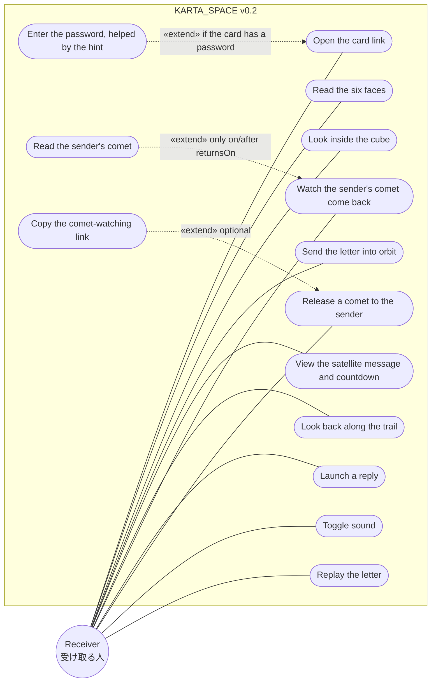

Notes:

- UC4 onward (the orbit use cases) is reached only after UC2, by reading past the last face.
- The receiver never signs in. `Launch a reply` and `Release a comet` ask only for a name and a message.
- `Look inside the cube` exists only if the card has a `secret`; each orbit use case exists only if its config exists (§5).

### B1.2 Sender

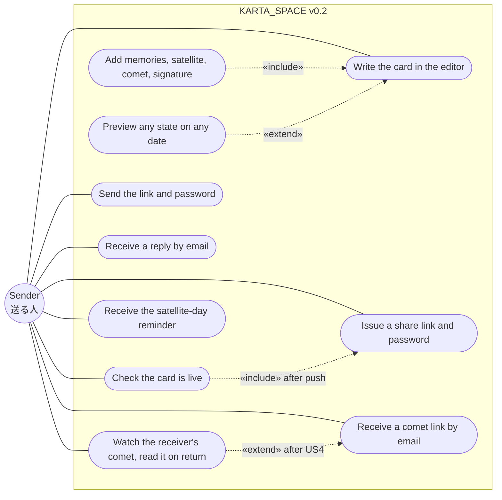

### B1.3 System actors

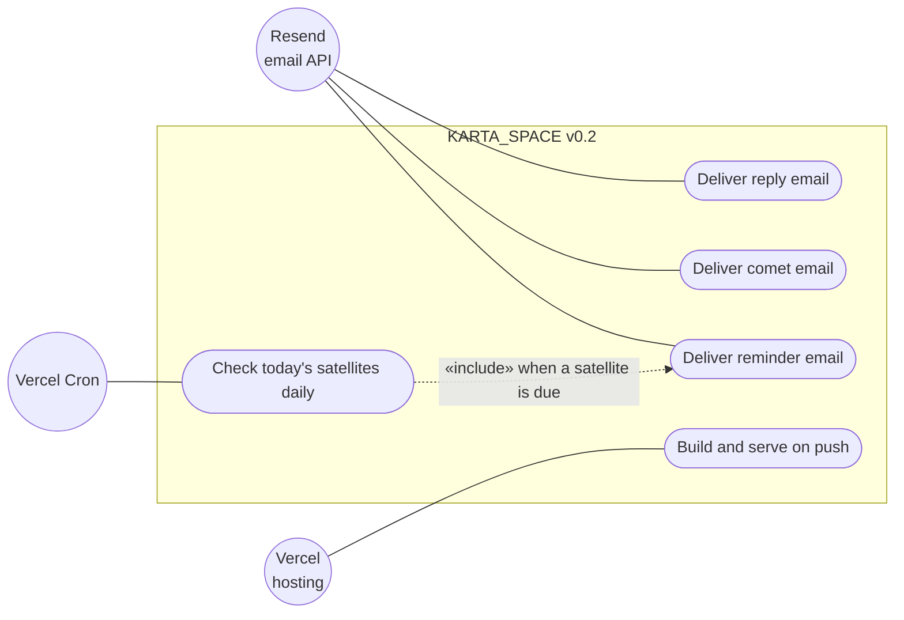

### B1.4 Use case summary

| ID | Use case | Actor | Feature | Preconditions | Result |
|---|---|---|---|---|---|
| UC1 | Open the card link | Receiver | v0.1 | valid slug | landing shown |
| UC1a | Enter the password (with hint) | Receiver | F14 | card has a password | access cookie set |
| UC2 | Read the six faces | Receiver | v0.1 (+F7) | opened | reaches closing screen |
| UC3 | Look inside the cube | Receiver | v0.1 | `secret` | secret line shown |
| UC4 | Send the letter into orbit | Receiver | F1 | `hasOrbit` | orbit view |
| UC5 | View satellite message | Receiver | F2 | `satellite` | panel with countdown or "returned" |
| UC6 | Look back along the trail | Receiver | F3 | `memories` | memories shown one by one |
| UC7 | Watch the sender's comet | Receiver | F4a | `comet.message` | comet at its real position; countdown |
| UC7a | Read the sender's comet | Receiver | F4a | date reached | message shown |
| UC8 | Launch a reply | Receiver | F10 | `reply` + mail env | email to sender, star in sky |
| UC9 | Release a comet to the sender | Receiver | F4b | `receiverCanRelease` + mail env + `COMET_SECRET`, date in future | email with comet link to sender |
| UC9a | Copy the comet-watching link | Receiver | F4b (Could) | UC9 done | link on clipboard |
| UC10 | Toggle sound | Receiver | F5 | `sound !== false` | preference stored locally |
| UC11 | Replay | Receiver | v0.1 | closing screen | back to face 1 |
| US1 | Write the card | Sender | F12 | dev server | `cards.config.ts` updated |
| US1b | Preview any state and date | Sender | F12 | dev server | iframe shows `?at=` / `?now=` |
| US7 | Issue link and password | Sender | F14 | dev server | slug, hash in config, plaintext in `.karta/` |
| US8 | Check the card is live | Sender | F14 | pushed | Live ✓ / older / not live |
| US2 | Send link and password | Sender | F14 | Live ✓ | receiver can open |
| US3 | Receive a reply | Sender | F10 | UC8 | email in inbox |
| US4 | Receive a comet link | Sender | F4b | UC9 | email with link |
| US5 | Watch / read the receiver's comet | Sender | F4b | US4 | position, then message on the day |
| US6 | Receive the reminder | Sender | F11 | `satellite` + notify env, cron | email on the day |

## B2. Sequence diagrams

### B2.1 Open the card (gate with hint, page payload)

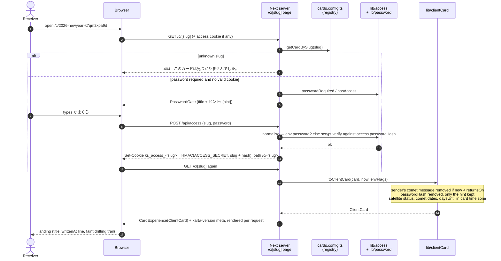

### B2.2 Read the letter and deploy into orbit

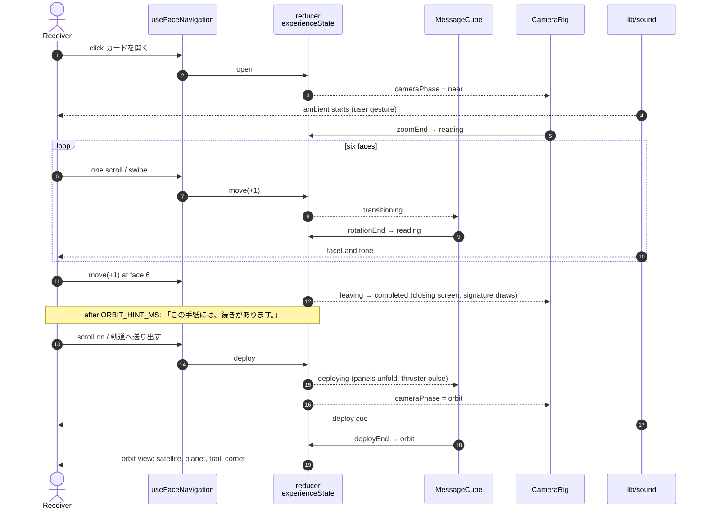

### B2.3 Look back along the trail (contrails)

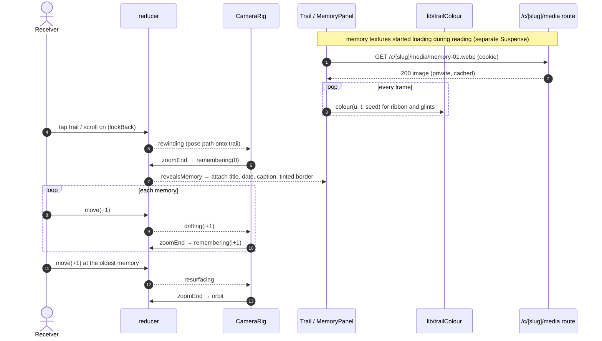

### B2.4 Satellite and the sender's comet

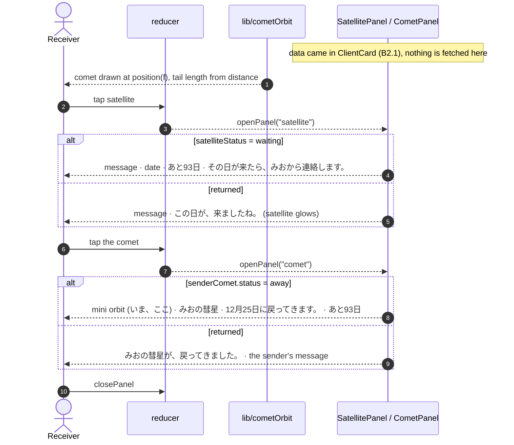

### B2.5 Launch a reply (rocket → sender)

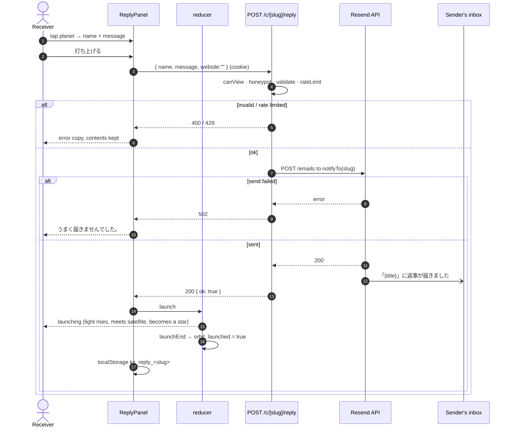

### B2.6 Release a comet to the sender

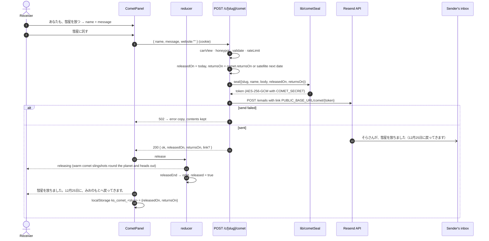

### B2.7 The sender follows a comet link

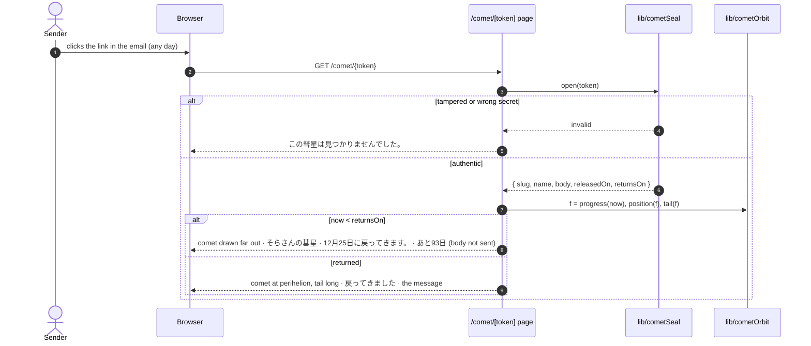

### B2.8 Satellite-day reminder to the sender

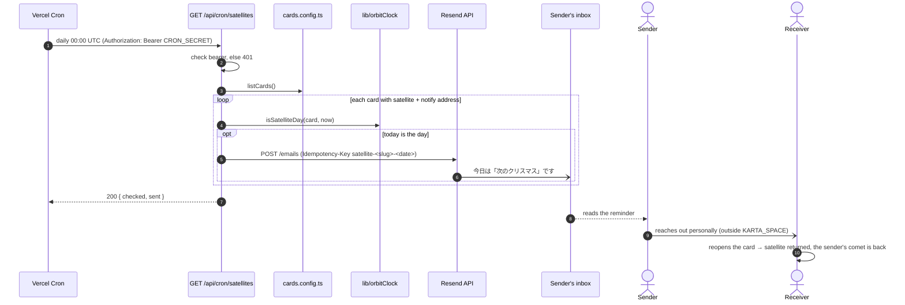

### B2.9 Issue a share link and password (editor)

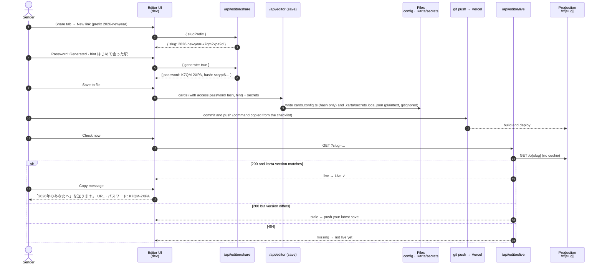

## B3. Data flow diagrams

Notation: rectangles = external entities, circles = processes, cylinders = data stores. **There is no database.** The persistent stores are the repository (config and images), environment variables, the sender's machine (`.karta/`), the receiver's browser, and the sender's inbox, which is outside the system.

### B3.1 Level 0 (context)

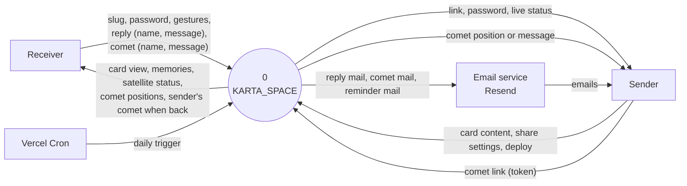

### B3.2 Level 1

Level 1 has ten processes. It is drawn in three parts so each stays readable; the stores are the same in all three.

| Process | Name | Runs on |
|---|---|---|
| 1 | Grant card access | server (`/api/access`) |
| 2 | Build client card | server (`/c/[slug]` page, `toClientCard`) |
| 3 | Run the experience | receiver's browser |
| 4 | Serve memory media | server (`/c/[slug]/media`) |
| 5 | Accept reply | server (`/c/[slug]/reply`) |
| 6 | Release receiver's comet | server (`/c/[slug]/comet`) |
| 7 | Show a comet | server (`/comet/[token]` page) |
| 8 | Send satellite reminder | server (`/api/cron/satellites`) |
| 9 | Author cards | sender's machine (dev editor) |
| 10 | Issue link and password, check live | sender's machine (dev editor) |

| Store | Contents |
|---|---|
| D1 | `config/cards.config.ts` (repo), including `access.passwordHash` and hint |
| D2 | `private/cards/<slug>/` images (repo, not public) |
| D3 | environment variables and secrets |
| D4 | receiver's browser: access cookie + localStorage |
| D5 | in-memory rate-limit counters (lost on cold start) |
| D6 | `.karta/secrets.local.json` on the sender's machine (gitignored) |

#### B3.2a Viewing the card (processes 1–4)

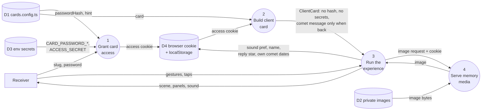

#### B3.2b Messages to the sender (processes 5–7)

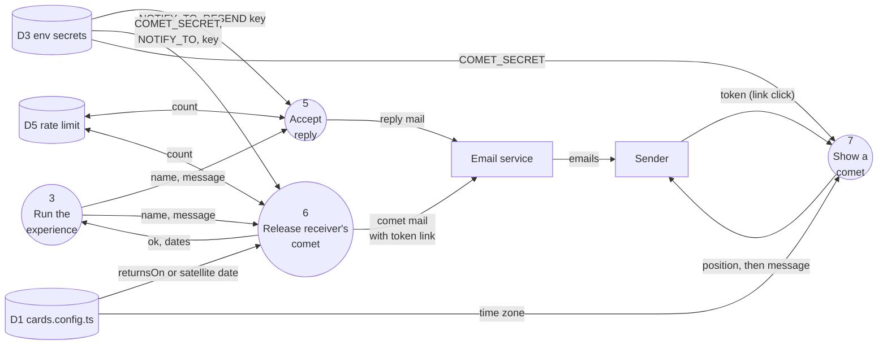

#### B3.2c Reminder, authoring and sharing (processes 8–10)

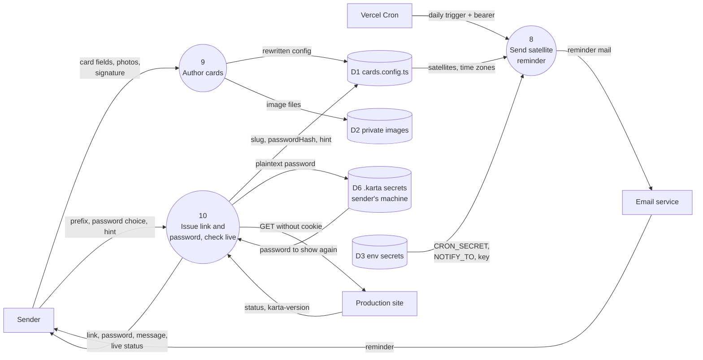

### B3.3 Data dictionary

| Data | Composition | Where it lives | Leaves the server? |
|---|---|---|---|
| Card | `CardConfig` (§5) | D1 (repo) | only as ClientCard |
| ClientCard | card − `comet.message` (until back) − `access.passwordHash` − reply config + computed status | per request | yes, to the receiver's browser |
| Password (plain) | generated `XXXX-XXXX` or the sender's own | D6 only, and wherever the sender sends it | never from the server |
| Password hash | `scrypt$32768$8$1$salt$hash` | D1 | never to a browser |
| Password hint | ≤ 40 chars | D1 | yes, on the gate |
| Access cookie | HMAC(ACCESS_SECRET, slug + hash), or HMAC of the env password | D4 (HttpOnly, path `/c/<slug>`) | – |
| Memory image | WebP/JPEG ≤ 350 KB | D2 (repo, not public) | yes, only through P4 with access |
| Reply | name (≤ 20) + message (≤ 140) + sentAt | nowhere; passes through P5 | yes, as email to the sender |
| Receiver's comet | name (≤ 20) + body (≤ 200) + releasedOn + returnsOn | nowhere; encrypted into the token | yes, as an email link to the sender |
| Comet token | base64url(iv ‖ AES-256-GCM ciphertext ‖ tag) | the sender's email (and the receiver's clipboard if copied) | – |
| Reminder | satellite label/message + card link | nowhere; built by P8 | yes, as email to the sender |
| karta-version | 12 hex of a hash of the card config | computed per request | yes, as a meta tag |
| Sender address | `NOTIFY_TO` / `CARD_NOTIFY_TO_<SLUG>` | D3 | never to a browser |
| Secrets | `CARD_PASSWORD_*`, `ACCESS_SECRET`, `COMET_SECRET`, `RESEND_API_KEY`, `CRON_SECRET` | D3 | never |
| Local prefs | `ks_sound`, `ks_name`, `ks_reply_<slug>`, `ks_comet_<slug>`, `ks_opened_<hash>` | D4 (localStorage) | never |
| Rate-limit counters | key → count, resetAt | D5 (memory, lost on cold start) | never |

## B4. State diagram (experience)

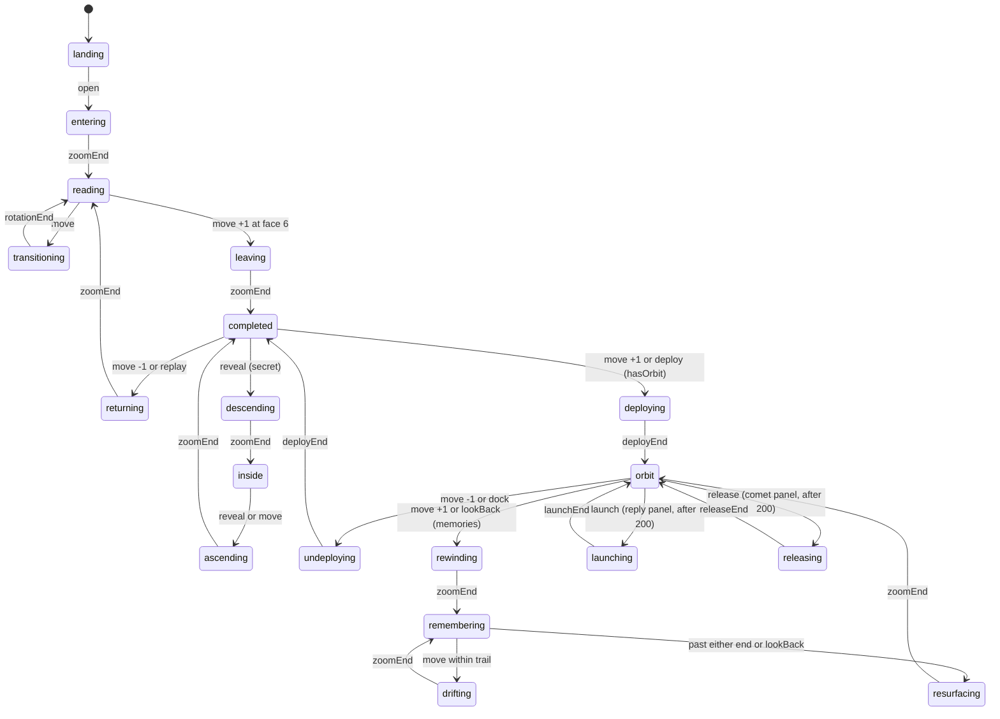

`openPanel` / `closePanel` change `panel` inside `orbit` without changing state, so they are not drawn.

---

# Part C — Design mockups

Each feature has its own row in the **KARTA_SPACE v0.2 mockups** design canvas: https://claude.ai/artifact/A2tNPJyQpoauYQ9LXxGbtd (private until shared from its Share menu). There is one artboard per state.

- Mobile portrait (390 × 844) is primary.
- M5 also has a desktop frame (1280 × 800).
- The emails are 520 × 760; the editor is 1440 × 900.

**Look.**

- **The frames are alive.** They animate the ambient of §23 with CSS: nebula drift and breath, twinkle, wandering lights, dust, grain, camera breathing, the moving sun on the planet, satellite drift with nav light and glints, and drifting trail colours. §23.6 maps each animation to its implementation.
- Every margin, padding, gap and offset in them is on the 8-point grid (checked: 0 values off-grid).
- Colours and type come from `app/globals.css`: the space-metal palette, Noto Sans JP, and the existing `.button`, `.button--ghost` and `.button--quiet` styles.
- Glass panels are `rgba(10,12,16,0.78)` with `backdrop-filter: blur(16px)`, a `rgba(176,180,186,0.2)` border, a 1px inner top highlight and a 24px radius.
- Small grey labels are lifted from `--titanium` to `#8e97a0` so they pass 4.5:1 on the void. Use that value in the build too.
- **Warm light** (`#f3e6cf` / `#f3d7a4`) means "from the receiver" or "opened/returned" (principle 11). Everything else stays ion-blue.
- The trail colours in every frame come from the same `trailColour` function as §9.1, with one seed.

**Sample content** used throughout:

- sender `from: "みお"`, receiver name そら;
- the satellite and both comets return on 2026-12-25; today is 2026-09-23 (あと93日);
- the sender's comet left on 2026-03-01, so today it is 69% of the way round;
- photos are labelled placeholders.

| ID | Artboard file | State shown | Feature | Spec |
|---|---|---|---|---|
| M0 | `M0-Gate-hint.dc.html` | Password gate with the sender's hint | F14 | §7, §14.9 |
| M1a | `Main.dc.html` | Landing with the written-at line, faint trail, sound toggle | F8, F5, F3 | §7 |
| M1b | `M1b-Landing-returned.dc.html` | Landing after the satellite date | F2 | §7 |
| M2 | `M2-Line-face.dc.html` | A `line` face, 4 / 6 | F7 | §13.2 |
| M3a | `M3a-Closing-signature.dc.html` | Closing line + handwritten signature | F6 | §8.1, §13.1 |
| M3b | `M3b-Closing-offers.dc.html` | + orbit offer (3.5 s) and quieter secret offer (7 s) | F1 | §8.1 |
| M4a | `M4a-Deploy-turn.dc.html` | t≈0.25: turn to 3/4 view, panels still folded | F1 | §8.2 |
| M4b | `M4b-Deploy-unfold.dc.html` | t≈0.5: panels swinging up, planet rising | F1 | §8.2 |
| M4c | `M4c-Deploy-rise.dc.html` | t≈0.85: thruster pulse, onto the orbit | F1 | §8.2 |
| M5a | `M5a-Orbit-mobile.dc.html` | Orbit hub, the sender's comet a far glint, bottom bar | F1, F4a | §8.3 |
| M5b | `M5b-Orbit-desktop.dc.html` | Orbit hub on desktop, satellite hovered | F1 | §8.3 |
| M6a | `M6a-Satellite-waiting.dc.html` | Satellite panel: waiting, 「みおから連絡します」, no calendar | F2 | §8.4 |
| M6b | `M6b-Satellite-returned.dc.html` | Satellite panel: returned, satellite warm, comet close | F2 | §8.4 |
| M7a | `M7a-Contrail-photo.dc.html` | Newest memory with photo, 2025年8月頃, frame tinted by the trail | F3 | §9 |
| M7b | `M7b-Contrail-text.dc.html` | Oldest memory, text only, 2022年春; colours have drifted | F3 | §9 |
| M7c | `M7c-Contrail-drift.dc.html` | The same trail at 0 s, 20 s, 40 s | F3 | §9.1 |
| M8a | `M8a-Reply-panel.dc.html` | Reply panel: name + message only | F10 | §10.2 |
| M8b | `M8b-Reply-launching.dc.html` | Launch: soft light rising from the planet | F10 | §10.3 |
| M8c | `M8c-Reply-star.dc.html` | After: the reply star; 返事は届きました | F10 | §10.3–10.4 |
| M8d | `M8d-Reply-error.dc.html` | Send failed: message kept, no launch (the comet form fails the same way) | F10, F4b | §10.2, §11.3 |
| M9a | `M9a-Comet-panel.dc.html` | The sender's comet on its way (mini orbit, いま、ここ) + release your own | F4a, F4b | §11.3 |
| M9b | `M9b-Comet-releasing.dc.html` | A warm comet slingshots round the planet and heads out | F4b | §11.4 |
| M9c | `M9c-Comet-released.dc.html` | Released: your warm comet far out; copy the watching link | F4b | §11.3 C |
| M9d | `M9d-Comet-returned.dc.html` | On the day: the sender's comet is back; its message | F4a | §11.3 A |
| M9e | `M9e-Comet-returned-scene.dc.html` | The returned day in the scene: warm satellite, comet close, meteors | F2, F4a | §11.2 |
| M10a | `M10a-Comet-page-away.dc.html` | The sender's comet page: the comet drawn where its dates put it | F4b | §11.7 |
| M10b | `M10b-Comet-page-returned.dc.html` | The same page on the day: the message | F4b | §11.7 |
| M10c | `M10c-Comet-page-invalid.dc.html` | Tampered or unknown link | F4b | §11.7 |
| M11a | `M11a-Email-reply.dc.html` | Reply email | F10 | §14.8 |
| M11b | `M11b-Email-comet.dc.html` | Comet email with the link | F4b | §14.8 |
| M11c | `M11c-Email-reminder.dc.html` | Satellite-day reminder email | F11 | §14.8 |
| E1 | `E1-Editor-basics.dc.html` | Basics (fuzzy date, from, sound) with the setup checklist open | F12 | §15.2, §15.4 |
| E2 | `E2-Editor-faces.dc.html` | Faces with the new Line type and the suggested arc | F12, F7 | §15.4 |
| E3 | `E3-Editor-memories.dc.html` | Memories: fuzzy dates, private photos, newest first | F12, F3 | §15.4 |
| E4 | `E4-Editor-orbit.dc.html` | Orbit: satellite, comets (with mini orbit), reply, reminder, setup chips | F12 | §15.4 |
| E5 | `E5-Editor-share.dc.html` | Share: link, generated password, hint, message, publish checklist, live check | F14 | §15.6 |
| E6 | `E6-Editor-signature.dc.html` | Closing tab with the signature pad open | F12, F6 | §15.5 |

The frames animate the ambient, not the feature transitions: a deployment, launch or release is shown as keyframes. Where a frame and the text of this spec disagree, the spec wins. The frames show composition, hierarchy, copy and the feel of the motion.
